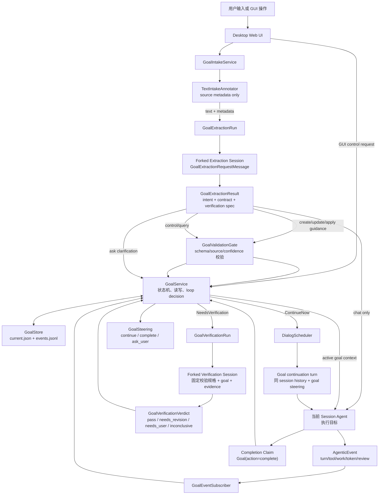
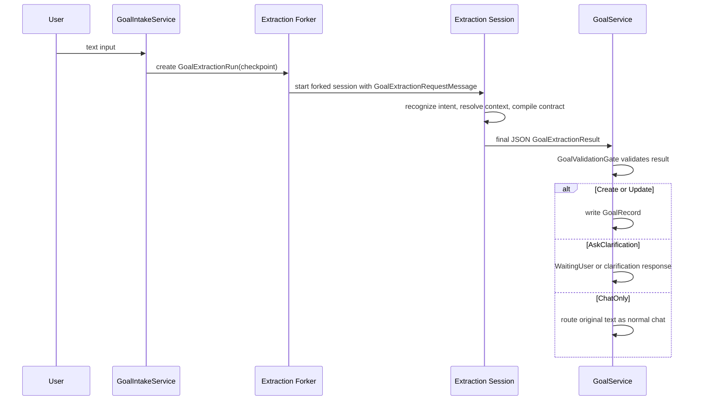
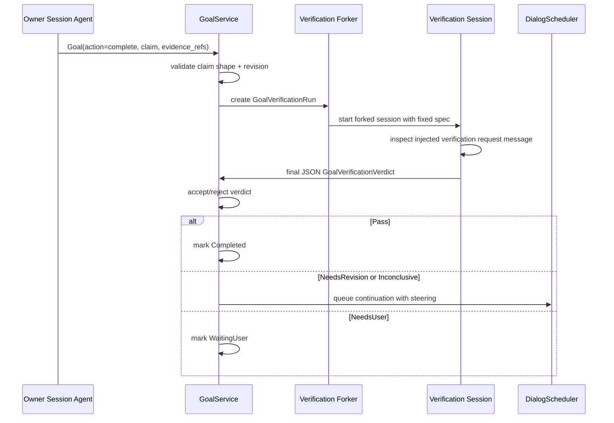

# Sparo /goal 会话目标机制设计

日期：2026-06-20

## 摘要

`/goal` 不是更长的 prompt，而是给一个 agent 会话增加可持久、可恢复、可校验的目标生命周期。普通 agent 在一轮对话结束后天然会停下；goal mode 要让系统在 turn 结束后仍然知道目标是否完成、是否继续、是否等待用户、是否进入校验、是否阻塞或暂停。

本方案只覆盖 Tauri desktop + Web UI 产品路径，core 保持平台无关。落地方式是一次到位的完整实现，不把可持久 goal、extraction fork、verification fork、证据闭环和 Web UI 拆成可独立发布的阶段。整体运行时仍由三个环节构成：

1. 目标提取：从当前会话 checkpoint fork 一个提取会话，用固定注入的 `GoalExtractionRequestMessage` 把用户输入和前文上下文编译成 `GoalContract`。
2. 目标跟踪与 Goal Loop：用 `GoalService + GoalEventSubscriber + DialogScheduler` 持续推进目标。
3. 目标完成校验：在完成声明点 fork 一个校验会话，用固定校验规格和 goal/evidence 判定是否完成，并产出继续或完成 steering。

参考 Codex 后只保留两点：目标必须显式开启，续跑应复用当前会话上下文。Codex 的 objective 原样写入和同模型自审完成判定不作为 Sparo 的最终方案。

适用边界：`/goal` 只面向 workspace-scoped agent session，例如 coding/Prime Builder 会话。Agentic OS 全局会话、`agentic_os` storage scope 会话和 OSAgent 不支持 `/goal` 目标模式，也不暴露 `Goal` owner tool；Agentic OS 的长期执行闭环继续由 `Work`、`OutcomeReview` 和后台进程体系承担。

## 设计原则

- Goal 是完成契约，不是任务备注。
- Goal 属于 workspace agent session，不属于 Agentic OS 全局会话；`agentic_os` scope 下 `/goal` 按普通文本处理。
- 目标生命周期归 `GoalService` 所有，不归执行 agent 所有。
- 执行仍由当前 session agent 完成，goal continuation 只是同一 session 的下一轮 turn。
- GUI 控制入口直接调用结构化 request API；所有文本入口都触发目标提取 fork。
- 文本入口不做规则分流；`/goal` 前缀、输入来源、GUI affordance 只作为 payload 元数据，intent/control 判断统一由 extraction fork 完成。
- “按以上方案实施”这类指代目标必须解析前文并冻结上下文，不能把短句直接作为 objective。
- 目标提取也要 fork 独立会话执行；提取会话只读上下文、输出结构化结果，不直接写 goal。
- 完成不能靠 assistant final response，也不能靠执行 agent 自我声明；必须通过 fork 出来的校验会话按固定规格验证。
- 校验会话只负责判定和产出 steering，不直接写 goal 状态；最终状态仍由 `GoalService` 接受。

## 总体流程



## 1. 目标提取

目标提取解决的问题是：用户真正要系统持续推进的目标是什么，以及什么条件下可以认为它完成。

### 1.1 输入分层

入口先区分两类输入：

| 输入类型 | 示例 | 处理方式 |
| --- | --- | --- |
| GUI 控制 | 点击 pause、resume、status、review、clear | Web UI 直接调用结构化 request API |
| 文本输入 | `/goal status`、`/goal pause`、`/goal 按以上方案实施`、`开始按上面方案做`、普通讨论 | 创建 `GoalExtractionRun`，fork 提取会话，注入 `GoalExtractionRequestMessage` |

文本入口只记录原文、入口来源和 `/goal` 前缀等显式元数据，不用字符规则决定语义。目标创建、修改、补充指导、指代消解、普通聊天、查询和控制都由 extraction session 的结构化输出统一完成。

### 1.2 Forked Extraction Session

文本输入不在 owner session 的执行流程里直接解析。`GoalIntakeService` 在当前 turn checkpoint 创建 `GoalExtractionRun`，fork 一个只读提取会话，并注入由固定 extraction instruction 与动态 payload 组成的 `GoalExtractionRequestMessage`。

```rust
pub struct GoalExtractionRun {
    pub extraction_id: String,
    pub parent_session_id: String,
    pub extraction_session_id: String,
    pub trigger_turn_id: String,
    pub raw_input: String,
    pub checkpoint_event_id: String,
    pub status: GoalExtractionStatus,
}
```

fork 提取会话接收的不是完整开放上下文，而是提取快照：

- 当前用户 raw input。
- 输入来源、是否包含 `/goal` 前缀等显式 affordance 元数据。
- 最近 relevant session excerpt。
- 最近 assistant 方案、用户确认点和候选 source refs。
- 当前 active goal 摘要，用于判断 update/apply guidance。
- 文件、Work、artifact 引用摘要。
- 固定 extraction output schema。

提取会话约束：

- 不拥有 goal 生命周期。
- 不写 workspace。
- 不暴露模型工具。
- 不创建、修改、完成 goal。
- 输出只能是 final JSON，`GoalService` 解析为 `GoalExtractionResult`。

### 1.3 固定 Extraction Request

提取会话使用固定注入请求，而不是把提取逻辑散落在普通 agent prompt 中。固定 instruction 职责为三步：

1. `IntentRecognition`：判断当前输入是 `ChatOnly/CreateGoal/UpdateGoal/ApplyGuidance/QueryGoal/ControlGoal/AskClarification`。
2. `ContextResolution`：如果是指代目标，解析前文并生成 frozen context 和 source refs。
3. `ContractCompilation`：生成 `GoalContract` 和 `GoalVerificationSpec`。

instruction 约束：

- 普通方案讨论、风险追问、解释性问题默认是 `ChatOnly`。
- `CreateGoal/UpdateGoal/ApplyGuidance` 可以引用前文，但必须输出 source refs。
- `QueryGoal/ControlGoal` 必须来自当前 raw input 或显式入口元数据，不能从历史上下文推断。
- 不确定时输出 `AskClarification`，不能静默创建模糊目标。
- 所有输出必须符合 `GoalExtractionResult` schema。

`GoalService` 将固定 instruction 和动态 payload 封装成一条内部请求消息发给 fork 会话：

```rust
pub struct GoalExtractionRequestMessage {
    pub extraction_id: String,
    pub instruction_version: String,
    pub fixed_instruction: String,
    pub payload: GoalExtractionPayload,
    pub output_schema: String,
}
```

这条消息是 fork 会话的主要输入。payload 包含 raw input、entry affordance metadata、上下文摘录、source refs 和 active goal 摘要；这些内容不通过工具读取。

固定消息骨架：

```text
Injected request message:
You are a goal extraction worker for Sparo.
Your task is to classify the current user input and, only when the user is explicitly asking for goal mode, compile a durable GoalContract.

You must use only the supplied extraction snapshot:
- raw user input
- entry affordance metadata
- parent session excerpt
- candidate source refs
- active goal summary
- linked file/work/artifact refs

Return only GoalExtractionResult JSON.
Do not execute the goal.
Do not edit files.
Do not mark any goal complete.
Every objective, criterion, constraint, and verification check must cite source_refs or the current raw input.
If the input is ordinary discussion, return ChatOnly.
If context is ambiguous, return AskClarification.
```

### 1.4 Extraction 输出

```rust
pub struct GoalExtractionResult {
    pub extraction_id: String,
    pub parent_session_id: String,
    pub trigger_turn_id: String,
    pub intent: GoalIntentDecision,
    pub context_resolution: Option<GoalContextResolution>,
    pub contract: Option<GoalContract>,
    pub confidence: f32,
    pub warnings: Vec<String>,
}

pub enum GoalIntentKind {
    ChatOnly,
    CreateGoal,
    UpdateGoal,
    ApplyGuidance,
    QueryGoal,
    ControlGoal,
    AskClarification,
}

pub struct GoalIntentDecision {
    pub kind: GoalIntentKind,
    pub confidence: f32,
    pub raw_trigger: String,
    pub target_goal_id: Option<String>,
    pub control_action: Option<GoalControlAction>,
    pub reason_summary: String,
    pub source_refs: Vec<GoalSourceRef>,
    pub clarification_questions: Vec<String>,
}
```

`GoalContextResolution` 负责保存指代解析结果：

```rust
pub struct GoalContextResolution {
    pub resolved_objective: String,
    pub included_source_refs: Vec<GoalSourceRef>,
    pub excluded_source_refs: Vec<GoalSourceRef>,
    pub frozen_context_markdown: String,
    pub confidence: f32,
    pub ambiguity_questions: Vec<String>,
}
```

解析规则：

- 前文只有一个明确方案且用户表达执行意图：可以继续编译 goal。
- 前文有多个候选方案：进入 `AskClarification` 或 `WaitingUser`。
- 前文只是头脑风暴：生成候选摘要并要求确认。
- 前文互相矛盾：列出冲突点，不创建 active goal。
- source refs 找不到或 confidence 过低：不能创建 `Active`。

`GoalContract` 把 `raw_trigger + resolved_objective + frozen_context` 编译为可执行和可校验的完成契约：

```rust
pub struct GoalContract {
    pub raw_trigger: String,
    pub resolved_objective: String,
    pub success_criteria: Vec<GoalCriterion>,
    pub non_goals: Vec<String>,
    pub constraints: Vec<String>,
    pub verification_spec: GoalVerificationSpec,
    pub risk_level: GoalRiskLevel,
    pub completion_policy: GoalCompletionPolicy,
}

pub struct GoalCriterion {
    pub id: String,
    pub description: String,
    pub required: bool,
    pub evidence_requirements: Vec<GoalEvidenceRequirement>,
    pub source_refs: Vec<GoalSourceRef>,
}
```

提取会话可以把用户目标拆成 success criteria、non-goals、verification spec 和 risk level，但不能把没有 source ref 支持的建议扩大成必做范围。范围扩张必须变成确认问题。

### 1.5 GoalValidationGate

`GoalValidationGate` 是确定性校验层。通过它之后才允许写入 goal。

校验项：

- schema 合法。
- `extraction_id/parent_session_id/trigger_turn_id` 匹配当前 intake。
- `resolved_objective` 非空。
- 指代型 goal 必须有可回放 source refs。
- 每个 required criterion 必须有 source refs 或来自当前 user trigger。
- criteria、constraints、non-goals 不能超出 source refs 支持范围。
- verification spec 必须能映射到可观察 evidence。
- confidence 低、source refs 冲突、候选方案并列时进入 `WaitingUser`。

### 1.6 目标提取流程



## 2. 目标跟踪与 Goal Loop

Goal loop 解决的问题是：agent 一轮结束后如何继续推进目标，而不是自然停在 final response。

### 2.1 核心对象

```rust
pub struct GoalRecord {
    pub goal_id: String,
    pub session_id: String,
    pub revision: u64,
    pub status: GoalStatus,
    pub contract: GoalContract,
    pub context: GoalContextSnapshot,
    pub progress: GoalProgress,
    pub budgets: GoalBudgets,
    pub evidence_refs: Vec<GoalEvidenceRef>,
    pub linked_work_ids: Vec<String>,
    pub latest_verification: Option<GoalVerificationSummary>,
    pub created_at_ms: i64,
    pub updated_at_ms: i64,
}

pub enum GoalStatus {
    Active,
    WaitingUser,
    Paused,
    Blocked,
    BudgetLimited,
    ReviewRequired,
    Verifying,
    Completed,
    Cancelled,
}
```

`GoalRecord` 是 session 级 current goal。所有写入必须走 `GoalService`，使用 `expected_goal_id + expected_revision` 防止旧 turn 覆盖新状态。

### 2.2 事件驱动

`GoalEventSubscriber` 监听：

- `DialogTurnStarted`
- `DialogTurnCompleted`
- `DialogTurnFailed`
- `DialogTurnCancelled`
- `ToolEvent::Started/Completed/Failed/ConfirmationNeeded`
- `TokenUsageUpdated`
- Work execution finished message
- verification verdict

事件进入后只做事实归集，不做自然语言语义判断：

```text
AgenticEvent
  -> GoalEventSubscriber
  -> GoalProgressSnapshot
  -> GoalService.decide_after_event(...)
```

### 2.3 Loop Decision

`GoalService` 输出：

```rust
pub enum GoalLoopDecision {
    ContinueNow(GoalSteering),
    WaitForUser(UserQuestion),
    WaitForWork(Vec<String>),
    StartVerification(GoalVerificationRunRequest),
    Pause,
    MarkBlocked(GoalBlockerSummary),
    StopForBudget,
    Noop,
}
```

决策顺序：

1. 没有 active goal：`Noop`。
2. goal 是 paused/cancelled/completed：`Noop`。
3. 当前 session 正在 processing 或已有用户输入排队：`Noop`，不抢占用户。
4. 达到预算或使用限制：`StopForBudget`。
5. required linked Work 仍 running：`WaitForWork`。
6. 需要用户确认、工具确认或外部选择：`WaitForUser`。
7. agent 提交 completion claim：`StartVerification`。
8. 连续无进展达到阈值：`MarkBlocked` 或 `WaitForUser`。
9. goal 仍 active 且存在可执行缺口：`ContinueNow`。

### 2.4 Continuation Turn

继续执行使用现有 scheduler 排队新 turn：

```rust
scheduler.submit_with_metadata(
    goal.session_id.clone(),
    steering.display_text,
    Some("Continuing active goal".to_string()),
    None,
    goal.agent_type.clone(),
    Some(steering.system_reminder),
    goal.workspace_path.clone(),
    DialogSubmissionPolicy::for_source(DialogTriggerSource::AgentSession)
        .with_queue_priority(DialogQueuePriority::Low),
    None,
    None,
    Some(goal_continuation_metadata(&goal)),
).await?;
```

续跑仍在同一个 session 中运行，继承 session history，并额外注入稳定 goal steering：

```text
Active goal:
- Objective
- Required criteria
- Current evidence
- Evidence gaps
- Linked Work
- Budget
- Current steering

Do not mark the goal complete through a final answer.
When you believe the goal is complete, call Goal(action="complete") with evidence refs.
If not complete, make concrete progress toward the remaining gaps.
```

### 2.5 Agent 工具权限

执行 agent 只能声明，不能直接改生命周期：

```text
Goal(action="get")
Goal(action="progress")
Goal(action="submit_evidence")
Goal(action="complete")
Goal(action="blocked")
```

限制：

- `complete` 是 completion claim，不直接写 `Completed`。
- `blocked` 是 blocker claim，由服务层用 fingerprint 和连续轮次判定。
- agent 不能 pause/resume/clear/edit objective/set budget。
- Work completed 只产生 evidence，不代表 goal completed。

## 3. 目标完成校验：Fork 校验会话

完成校验解决的问题是：系统如何证明 goal 可以停下，以及如何把未完成点反馈成下一轮 steering。

### 3.1 触发点

进入校验的触发条件：

- 执行 agent 调用 `Goal(action="complete")`。
- `GoalService` 判断所有 required work 已结束，且 evidence 看起来覆盖主要 criteria。
- 用户点击 review/evidence/status 后要求复核。
- 风险策略要求在完成前必须独立校验。

触发后，`GoalService` 把 goal 状态设为 `Verifying`，创建 `GoalVerificationRun`。

### 3.2 Fork Verification Session

校验不是在执行 agent 原 turn 里完成，而是从校验点 fork 一个独立校验会话。

```rust
pub struct GoalVerificationRun {
    pub verification_id: String,
    pub parent_session_id: String,
    pub verification_session_id: String,
    pub goal_id: String,
    pub goal_revision: u64,
    pub checkpoint_event_id: String,
    pub spec: GoalVerificationSpec,
    pub evidence_bundle: GoalEvidenceBundle,
    pub status: GoalVerificationStatus,
}
```

fork 会话继承的是“校验快照”，不是继续执行上下文：

- `GoalContract`
- `GoalContextSnapshot`
- `GoalVerificationSpec`
- completion claim
- evidence refs
- linked Work summary
- 当前 workspace 状态入口
- 最近 relevant session excerpt

校验会话约束：

- 不拥有 goal 生命周期。
- 不写 workspace 源文件。
- 不暴露模型工具。
- 不自行读取 workspace；需要的 goal、spec、evidence、diff、Work 状态、check result 都由 `GoalService` 封装进固定注入消息。
- 输出只能是 final JSON，`GoalService` 解析为 `GoalVerificationVerdict`。

### 3.3 固定校验规格

`GoalVerificationSpec` 在目标提取阶段生成，并在校验时固定注入。

```rust
pub struct GoalVerificationSpec {
    pub criteria: Vec<GoalCriterion>,
    pub required_evidence: Vec<GoalEvidenceRequirement>,
    pub required_checks: Vec<GoalVerificationCheck>,
    pub allowed_exemptions: Vec<GoalVerificationExemption>,
    pub risk_policy: GoalRiskPolicy,
    pub output_schema_version: String,
}

pub struct GoalVerificationCheck {
    pub id: String,
    pub description: String,
    pub command: Option<String>,
    pub required: bool,
    pub evidence_kinds: Vec<GoalEvidenceKind>,
}
```

`GoalService` 将固定校验 instruction 和动态 payload 封装成一条内部请求消息发给 fork 会话：

```rust
pub struct GoalVerificationRequestMessage {
    pub verification_id: String,
    pub instruction_version: String,
    pub fixed_instruction: String,
    pub goal: GoalContract,
    pub context: GoalContextSnapshot,
    pub spec: GoalVerificationSpec,
    pub claim: GoalCompletionClaim,
    pub evidence_bundle: GoalEvidenceBundle,
    pub output_schema: String,
}
```

`evidence_bundle` 应在服务层预先组装，包含 tool/work/file/test/review/user-confirmation 的可回放摘要和必要 diff/check result。verifier 只阅读这条消息并输出 verdict，不通过工具读取 bundle。

校验规则：

- 每个 required criterion 必须有 verdict。
- 每个 pass 的 criterion 必须绑定 evidence refs。
- evidence ref 必须能回放到 tool/work/file/test/review/user-confirmation。
- verification check 必须执行、复用已有有效结果，或给出 spec 允许的豁免。
- failed test/build/check 阻止 pass，除非 spec 明确允许豁免。
- required linked Work 不能有 running/failed/unreviewed 缺口。
- high risk goal 必须有独立校验 pass。
- verifier 不能用“看起来完成了”作为证据。

### 3.4 Verifier 输出

校验会话输出结构化 verdict：

```rust
pub enum GoalVerificationVerdictKind {
    Pass,
    NeedsRevision,
    NeedsUser,
    Inconclusive,
}

pub struct GoalVerificationVerdict {
    pub verification_id: String,
    pub goal_id: String,
    pub goal_revision: u64,
    pub verdict: GoalVerificationVerdictKind,
    pub criterion_results: Vec<VerifiedCriterionResult>,
    pub evidence_assessment: Vec<VerifiedEvidenceAssessment>,
    pub missing_evidence: Vec<GoalEvidenceGap>,
    pub failed_checks: Vec<GoalFailedCheck>,
    pub required_user_questions: Vec<String>,
    pub steering: GoalSteering,
    pub confidence: f32,
}
```

`GoalSteering` 是 verifier 给 owner loop 的下一步建议：

```rust
pub enum GoalSteeringKind {
    Continue,
    Complete,
    AskUser,
    Blocked,
}

pub struct GoalSteering {
    pub kind: GoalSteeringKind,
    pub display_text: String,
    pub system_reminder: String,
    pub remaining_gaps: Vec<GoalEvidenceGap>,
    pub recommended_actions: Vec<String>,
}
```

### 3.5 GoalService 接受 verdict

`GoalService` 对 verifier 输出再做确定性接受：

1. `verification_id/goal_id/revision` 必须匹配当前 goal。
2. verdict schema 合法。
3. pass 的 criteria 必须有 evidence refs。
4. evidence refs 必须存在且未过期。
5. verifier 没有越权写入 workspace 或目标状态。
6. confidence 低或 verdict inconclusive 时不能 complete。

接受后的状态转换：

| Verifier verdict | GoalService 动作 | Steering |
| --- | --- | --- |
| `Pass` | 写 `Completed`、`completed_at`、final summary | `Complete`，可向 owner session 发送完成摘要 |
| `NeedsRevision` | goal 回到 `Active`，记录 gaps | `ContinueNow`，下一轮按缺口修复 |
| `NeedsUser` | goal 转 `WaitingUser` | 向用户提出必须回答的问题 |
| `Inconclusive` | goal 回到 `Active` 或 `ReviewRequired` | 补证据、跑检查或请求人工确认 |

校验会话不能直接 complete goal。它只能提交 verdict 和 steering；最终状态由 `GoalService` 写入。

### 3.6 完成校验流程



## 4. /goal 工具与固定注入体系

`/goal` 不应该把所有交互都做成工具。工具只用于执行会话在工作过程中向 `GoalService` 声明事实；目标提取和完成校验这两个 fork 会话使用固定注入消息和结构化 final JSON，不暴露模型工具。

### 4.1 分层总览

| 运行上下文 | 是否模型会话 | 模型可见 /goal 工具 | 输入来源 | 输出方式 |
| --- | --- | --- | --- | --- |
| Desktop/Web UI | 否 | 无 | 用户点击或文本输入 | 结构化 request API |
| GoalIntakeService / Goal Loop | 否 | 无 | events、run state、GoalStore | 内部 service 写入 |
| Forked Extraction Session | 是 | 无 | `GoalExtractionRequestMessage` 固定注入 | final JSON `GoalExtractionResult` |
| Owner Execution Session | 是 | 一个 `Goal` 工具 | goal steering + session history | progress/evidence/claim |
| Forked Verification Session | 是 | 无 | `GoalVerificationRequestMessage` 固定注入 | final JSON `GoalVerificationVerdict` |

核心原则：

- extraction fork 和 verification fork 是“判定会话”，不是“工具执行会话”。
- goal、上下文、校验规格、证据包由服务层封装进固定注入消息，不让模型通过工具读取。
- 只有 owner execution session 需要 `Goal` 工具。
- GUI request API 和服务层内部 API 都不是模型工具。

### 4.2 固定注入消息

目标提取 fork 的输入是一条 `GoalExtractionRequestMessage`。它包含固定 extraction instruction、raw text、entry affordance metadata、上下文摘录、source refs、active goal 摘要和输出 schema。

完成校验 fork 的输入是一条 `GoalVerificationRequestMessage`。它包含固定 verification instruction、`GoalContract`、`GoalVerificationSpec`、completion claim、evidence bundle、Work/check/review 摘要和输出 schema。

这两类消息由 `GoalService` 或对应 run builder 生成。fork 会话只读取这条消息并输出 final JSON；`GoalService` 负责解析、schema 校验和状态写入。

```rust
pub enum GoalForkKind {
    Extraction,
    Verification,
}

pub struct GoalForkRequestMessage<T> {
    pub run_id: String,
    pub instruction_version: String,
    pub fixed_instruction: String,
    pub payload: T,
    pub output_schema: String,
}
```

实现上可以把固定 instruction 和 payload 放在一条内部 user message 中；如果 provider 的 KV cache 对 system prefix 更敏感，也可以物理拆成稳定 system message + 动态 payload message，但领域模型仍把它当一次固定 request。

### 4.3 Desktop/Web UI Request APIs

GUI 控制不是 agent tool，而是用户显式操作：

```rust
pub enum GoalUserAction {
    Status,
    Pause,
    Resume,
    Clear,
    Review,
    Evidence,
}

pub struct GoalUserRequest {
    pub session_id: String,
    pub expected_goal_id: Option<String>,
    pub expected_revision: Option<u64>,
    pub action: GoalUserAction,
}
```

约束：

- UI button 直接调用 request API。
- 文本 composer 不做语义解析，只把 raw text 交给 `GoalIntakeService`。
- request API 必须校验 session、goal id、revision 和用户可见状态。
- GUI control 可以 pause/resume/clear，因为这是用户直接操作；模型工具不能做这些动作。

### 4.4 GoalIntakeService 与 Goal Loop 内部接口

`GoalIntakeService` 和 `GoalService` 是服务层，不是模型会话，不暴露为 agent tool。

内部接口：

```rust
GoalIntakeService.receive_text(session_id, raw_text)
GoalIntakeService.receive_user_action(GoalUserRequest)
GoalService.create_or_update_from_extraction(GoalExtractionResult)
GoalService.decide_after_event(GoalProgressSnapshot)
GoalService.accept_verification_result(GoalVerificationVerdict)
GoalService.control_or_query(GoalUserRequest)
```

可访问依赖：

- `GoalStore`
- `EventRouter`
- `DialogScheduler`
- `SessionSnapshotProvider`
- `WorkStatusProvider`
- `BudgetMeter`
- `GoalRunStore`
- `GoalForkMessageBuilder`
- `GoalStructuredOutputParser`

约束：

- 可以读写 goal 状态和 events。
- 可以创建 extraction run、verification run、continuation turn。
- 可以组装固定注入消息和 evidence bundle。
- 不调用执行工具，不根据自然语言自由判断目标语义。
- loop decision 必须基于状态、事件、claim、verdict、预算和 Work 状态。

### 4.5 Owner Execution Session 的唯一 Goal 工具

owner execution session 是实际做事的会话。它可以使用原 agent 的执行工具；`/goal` 只额外提供一个 `Goal` 工具。

```text
Goal(action="get")
Goal(action="progress")
Goal(action="submit_evidence")
Goal(action="complete")
Goal(action="blocked")
```

工具语义：

| Action | 用途 | 写入效果 |
| --- | --- | --- |
| `get` | 读取 active goal、criteria、gaps、steering | 不写状态 |
| `progress` | 记录自然语言进度和剩余缺口 | append progress event |
| `submit_evidence` | 绑定 tool/work/file/test/user confirmation evidence | append evidence refs |
| `complete` | 提交 completion claim | 创建 verification request，不直接 complete |
| `blocked` | 提交 blocker claim | append blocker claim，由服务层判定 |

禁止动作：

- pause/resume/clear。
- 修改 objective、criteria、verification spec。
- 直接写 `Completed`。
- 直接启动 verification session。
- 伪造用户确认。

`complete` 的结果只能是 claim：

```rust
pub struct GoalCompletionClaim {
    pub goal_id: String,
    pub expected_revision: u64,
    pub summary: String,
    pub criteria_results: Vec<CriterionResult>,
    pub evidence_refs: Vec<GoalEvidenceRef>,
    pub residual_risks: Vec<String>,
}
```

### 4.6 服务侧证据组装不是模型工具

verification fork 不应该通过任何模型工具去收集材料或执行检查。证据组装在服务层完成：

```text
GoalEvidenceBundleBuilder
  -> resolve evidence refs
  -> load tool/work/file/test/review summaries
  -> attach existing check results
  -> mark missing required evidence
  -> build GoalVerificationRequestMessage
```

如果 `GoalVerificationSpec.required_checks` 里存在必须执行但尚未执行的 check，完整实现必须让 owner execution session 执行检查并通过 `Goal(submit_evidence)` 提交结果；如果服务侧已经具备非模型 verification-safe check runner，也可以由服务层执行同等检查并写入 evidence bundle。无论哪种方式，都不把 check runner 暴露成 verifier 的模型工具。

### 4.7 工具隔离规则

- forked extraction session 和 forked verification session 必须 `enable_tools=false`。
- extraction/verification 的模型输出通过 final JSON 解析，不通过 tool call。
- owner execution session 才能看到 `Goal(...)`。
- GUI request API 不是模型工具，不进入 agent tool registry。
- 服务层内部 API 不暴露给模型。
- 所有 goal tool call 和 fork final JSON 都写入 `events.jsonl`，包含 `run_id`、`goal_id`、`revision`、`fork_kind`。
- fork final JSON schema 校验失败时，run 标记 `Rejected`，不写 goal 状态。

### 4.8 当前工程基线与一次到位改造边界

当前工程的工具体系已经具备支撑 `/goal` 工具隔离的底层能力，但 goal 层仍必须完整接上 extraction/verification run、固定消息、parser/gate、run artifact 和状态机。

源码入口：

- `src/crates/core/src/agentic/tools/registry.rs`：全局工具注册和动态 MCP/Bridge App 工具注册。
- `src/crates/core/src/agentic/execution/execution_engine.rs`：按 agent tools、allowlist override 构建模型可见 `tool_definitions`。
- `src/crates/core/src/agentic/tools/restrictions.rs`：`ToolRuntimeRestrictions` 和路径限制。
- `src/crates/core/src/agentic/tools/pipeline/tool_pipeline.rs`：工具执行期 allowed tools 与 runtime restrictions 校验。
- `src/crates/core/src/agentic/coordination/coordinator.rs`：`DialogExecutionSettings`、hidden subagent/fork agent 执行入口。
- `src/crates/core/src/agentic/fork_agent/mod.rs`：fork agent request 携带 context、runtime restrictions、`enable_tools_override` 和 max turns。

已具备的工程基线：

- `ToolRegistry` 是全局注册表，启动时注册内置工具，也支持 MCP/Bridge App runtime tools 动态注册。
- agent 的默认工具来自 `Agent::default_tools()` 和 `AgentRegistry::get_agent_tools(...)`。
- `ExecutionContext.tool_allowlist_override` 会影响当前 turn 发给模型的 visible tool definitions。
- `ExecutionContext.runtime_tool_restrictions` 会进入 `ToolUseContext` 和 `ToolPipeline`，用于执行期拒绝不允许的工具、路径写入等。
- `ExecutionEngine` 每轮都会把 `tool_definitions` 传给 `AIClient.send_message_stream(...)`；工具定义数量、顺序、description、schema 都会进入模型请求。
- `ToolPipeline` 执行时还会检查 `allowed_tools` 和 `runtime_tool_restrictions`，所以当前存在“模型可见工具”和“实际可执行工具”两层。
- `ForkAgentExecutionRequest.enable_tools_override`、`HiddenSubagentExecutionRequest.enable_tools_override` 和 `ExecutionContext.context["enable_tools"]` 已经形成 no-tools fork 的底层通路；当该值为 `false` 时，`ExecutionEngine` 不向模型请求发送 tool definitions。

一次到位仍必须完成的 goal 层边界：

- extraction/verification 不能只依赖 `runtime_tool_restrictions`；必须显式设置 `enable_tools_override=false`，并把 no-tools 结果写入 run artifact 和 events。
- 当前 owner session 的稳定 `Goal` 工具只用于声明事实，不能替代 extraction fork 或 verification fork。
- 按每个 goal 动态生成工具定义会破坏请求前缀稳定性，影响 KV cache 命中；goal-specific 数据必须进入固定注入消息、steering 或 tool input。
- 工具权限策略散落在 agent defaults、allowlist override、runtime restrictions 和各 tool 自身 `needs_permissions` 中；goal run 必须补充单独审计点，记录 `model_tool_mode`、visible tool digest 和 runtime restriction digest。
- 现有 `service.rs` 中任何直接基于字符串的 `/goal status/pause/resume/clear/review` 分流、直接把 `/goal ...` rest 当 objective、以及本地同步完成判定，都只是过渡实现；完整方案必须被 extraction/verification run 取代。

### 4.9 最小工具面 + 动态上下文

`/goal` 工具体系应采用“最小工具面，动态上下文”的模型：

| 层级 | 是否动态 | 说明 |
| --- | --- | --- |
| Tool registry | 半动态 | 全局注册可以加载 MCP/Bridge App，但 `/goal` 内置能力只增加稳定的 `Goal` 工具 |
| Fork 工具面 | 静态 | extraction/verification fork 没有模型工具 |
| Owner Goal tool | 静态 | 只有一个 `Goal` 工具，description 和 schema 不随 goal 改变 |
| Tool runtime restrictions | 动态 | goal id、revision、path policy、run id 随 owner execution run 注入 |
| 固定注入消息 | 动态 payload | goal、source refs、verification spec、evidence bundle 放在请求消息，不放进工具 schema |
| Tool input | 动态 | 每次 tool call 的参数动态变化 |

结论：fork 会话不需要工具；执行会话只增加一个稳定 `Goal` 工具。不要为每个 goal 生成新工具，也不要把 goal-specific 规则写进 tool description。

### 4.10 KV Cache 约束

模型请求的稳定前缀通常包含 system prompt、工具 definitions 和早期上下文。当前工程每轮把 `tool_definitions` 传给 AI client；因此工具 definitions 变化会影响 token budget 和 KV cache。

设计要求：

- extraction/verification fork 设置 `enable_tools=false`，不发送 tool definitions。
- owner execution session 只额外增加稳定 `Goal` 工具。
- `Goal` 的 description 和 input schema 必须稳定。
- goal-specific 数据放入 extraction request message、goal steering、verification request message 或 `Goal` tool input，不放入工具定义。
- `GoalVerificationSpec.required_checks` 不生成工具；check result 作为 evidence bundle 的一部分注入。
- MCP/Bridge App 动态工具不进入 fork 会话；owner execution 是否包含外部工具由原 agent 默认工具配置决定。
- 固定注入消息内部把 fixed instruction 放在 payload 前，动态 payload 放后面，尽量保留可缓存前缀。

推荐工具定义顺序：

```text
Extraction:
no tools

OwnerExecution:
1. Goal
2. 原 agent 默认工具，保持当前 agent 默认顺序

Verification:
no tools
```

### 4.11 落地改造

需要在现有执行路径上增加 goal fork no-tools 支持和 owner `Goal` 工具注入：

```rust
pub enum GoalModelToolMode {
    NoTools,
    OwnerExecution,
}

pub struct GoalToolResolution {
    pub visible_tool_names: Vec<String>,
    pub runtime_restrictions: ToolRuntimeRestrictions,
    pub mode: GoalModelToolMode,
}
```

改造点：

- `ForkAgentExecutionRequest` 保留并显式使用 `enable_tools_override: Option<bool>`；若改用 `model_tool_mode` 抽象，语义必须等价。
- extraction/verification fork 设置 `enable_tools=false`，确保模型请求没有工具 definitions。
- `HiddenSubagentExecutionRequest` 透传 `enable_tools=false` 到 `ExecutionContext.context["enable_tools"]`。
- `DialogExecutionSettings` 支持 owner execution 的稳定 `Goal` 工具注入，把它加入模型可见工具列表。
- `ExecutionEngine` 保持工具定义顺序稳定，owner mode 下只额外插入稳定 `Goal`。
- `ToolPipeline` 继续保留执行期 `allowed_tools + runtime_tool_restrictions` 双重校验。
- `GoalForkMessageBuilder` 负责生成 extraction/verification 固定注入消息。
- `GoalStructuredOutputParser` 负责解析 fork final JSON。
- `events.jsonl` 记录 `model_tool_mode`、visible tool names digest、runtime restrictions digest，便于回放和审计。

owner execution 工具解析顺序：

```text
base agent default tools
  -> add stable Goal tool
  -> optional existing allowlist override
  -> runtime restrictions
  -> model-visible tool definitions + execution restrictions
```

extraction/verification fork 不走这条路径，而是强制 no-tools。

### 4.12 示例：agentic agent 的 /goal 工具与 fork 会话

以当前 `agentic` agent 为例，源码中 `AgenticAgent::default_tools()` 的内置默认工具为：

```text
Task
Read
Write
Edit
Delete
Memory
Bash
Grep
Glob
WebSearch
TodoWrite
GenerativeUI
Skill
AskUserQuestion
TerminalControl
ControlHub
```

实现 `/goal` 后，owner execution session 的模型可见工具基线为：

| 顺序 | 工具 | 来源 | 说明 |
| --- | --- | --- | --- |
| 1 | `Goal` | /goal 内置 | 稳定新增工具，只用于 `get/progress/submit_evidence/complete/blocked` |
| 2 | `Task` | agentic 默认 | 原有任务/子任务能力 |
| 3 | `Read` | agentic 默认 | 原有读文件能力 |
| 4 | `Write` | agentic 默认 | 原有写文件能力 |
| 5 | `Edit` | agentic 默认 | 原有编辑文件能力 |
| 6 | `Delete` | agentic 默认 | 原有删除文件能力 |
| 7 | `Memory` | agentic 默认 | 原有记忆能力 |
| 8 | `Bash` | agentic 默认 | 原有命令执行能力 |
| 9 | `Grep` | agentic 默认 | 原有文本搜索能力 |
| 10 | `Glob` | agentic 默认 | 原有文件匹配能力 |
| 11 | `WebSearch` | agentic 默认 | 原有网络搜索能力 |
| 12 | `TodoWrite` | agentic 默认 | 原有 todo 记录能力 |
| 13 | `GenerativeUI` | agentic 默认 | 原有生成 UI 能力 |
| 14 | `Skill` | agentic 默认 | 原有 skill 调用能力 |
| 15 | `AskUserQuestion` | agentic 默认 | 原有向用户提问能力 |
| 16 | `TerminalControl` | agentic 默认 | 原有终端控制能力 |
| 17 | `ControlHub` | agentic 默认 | 原有桌面控制能力 |

真实运行时仍要经过现有 `AgentRegistry::get_agent_tools(...)`、用户工具配置、动态 MCP/Bridge App 工具合并和 `runtime_tool_restrictions`。但 `/goal` 自身只新增稳定 `Goal` 工具；不会按 goal 动态生成新的工具定义。

`agentic` 在 `/goal` 模式下的 goal 相关 fork 会话列表为：

| Fork 会话 | 触发点 | parent | agent_type | 工具 | 输入消息 | 输出 | 写状态权限 |
| --- | --- | --- | --- | --- | --- | --- | --- |
| `GoalExtractionRun` / Extraction Session | 任意文本输入进入 goal intake 后 | 当前 `agentic` session checkpoint | 可复用当前 `agentic` agent_type，也可使用轻量 goal worker；无论 agent type 如何选择，都必须强制 no-tools | 无，`enable_tools=false` | `GoalExtractionRequestMessage` | final JSON `GoalExtractionResult` | 无，结果由 `GoalService` 接受 |
| `GoalVerificationRun` / Verification Session | owner session 调用 `Goal(action="complete")` 或服务层要求复核 | 当前 `agentic` session 的 completion checkpoint | 可复用当前 `agentic` agent_type，也可使用轻量 verifier；无论 agent type 如何选择，都必须强制 no-tools | 无，`enable_tools=false` | `GoalVerificationRequestMessage` | final JSON `GoalVerificationVerdict` | 无，verdict 由 `GoalService` 接受 |

因此，`agentic + /goal` 的模型会话不是“三套工具列表”，而是一套 owner 执行工具列表加两个 no-tools 判定 fork：

```text
Owner agentic session:
Goal + agentic effective tools

Extraction fork:
no tools
fixed injected GoalExtractionRequestMessage

Verification fork:
no tools
fixed injected GoalVerificationRequestMessage
```

## 数据与持久化

推荐 session-local 持久化：

```text
<session-dir>/goals/current.json
<session-dir>/goals/events.jsonl
<session-dir>/goals/snapshots/<goal-id>.md
<session-dir>/goals/extractions/<extraction-id>.json
<session-dir>/goals/verifications/<verification-id>.json
```

写入规则：

- append event，再原子替换 current。
- 所有状态变更记录 revision。
- extraction run、extraction result、completion claim、verification run、verdict、steering 都写入 events。
- clear 不删除历史，只清空 current pointer 或标为 `Cancelled`。

## 模块落点

新增 core 模块：

```text
src/crates/core/src/agentic/goal/
  mod.rs
  model.rs
  store.rs
  service.rs
  intake.rs
  extraction.rs
  validation.rs
  subscriber.rs
  verification.rs
  steering.rs
  fork_message.rs
  output_parser.rs
  instructions.rs

src/crates/core/src/agentic/tools/implementations/goal_tool.rs
```

核心职责：

| 模块 | 职责 | 不能做的事 |
| --- | --- | --- |
| `model.rs` | 定义 goal contract、run、intent、verdict、evidence、status、events 的可序列化契约 | 不放服务逻辑 |
| `store.rs` | 原子写 `current.json`，append `events.jsonl`，保存 snapshots/extractions/verifications | 不判断 goal 语义 |
| `intake.rs` | 接收文本入口，生成 `GoalTextIntake` 和 `GoalExtractionRunRequest` | 不用字符串决定 intent |
| `extraction.rs` | 驱动 extraction fork，记录 run lifecycle，返回 `GoalExtractionResult` | 不直接写 active goal |
| `verification.rs` | 驱动 verification fork，组装 evidence bundle，返回 `GoalVerificationVerdict` | 不直接写 `Completed` |
| `validation.rs` | deterministic gate：schema、source refs、confidence、revision、evidence 可回放性 | 不调用模型 |
| `steering.rs` | 生成 continuation/revision/user-question steering | 不修改 goal 状态 |
| `fork_message.rs` | 构造固定 `GoalExtractionRequestMessage` 和 `GoalVerificationRequestMessage` | 不拼接执行型 prompt |
| `output_parser.rs` | 从 fork final text 中提取和校验 JSON | 不做语义兜底 |
| `instructions.rs` | 保存固定 extraction/verifier instruction 和 output schema version | 不包含 goal-specific 动态数据 |
| `service.rs` | 唯一生命周期 owner；接受 gate/verdict，写状态，排 continuation | 不根据自然语言自由判断目标 |
| `subscriber.rs` | 监听 agentic events，归集事实快照并交给 `GoalService` 决策 | 不做 completion 判定 |
| `goal_tool.rs` | owner execution session 的稳定事实声明工具 | 不暴露 pause/resume/clear/edit/complete-state |

模型 fork 抽象：

```rust
#[async_trait]
pub trait GoalForkRunner: Send + Sync {
    async fn run_extraction(
        &self,
        request: GoalExtractionRunRequest,
    ) -> BitFunResult<GoalExtractionRunOutput>;

    async fn run_verification(
        &self,
        request: GoalVerificationRunRequest,
    ) -> BitFunResult<GoalVerificationRunOutput>;
}
```

生产实现使用 `ConversationCoordinator::capture_fork_agent_context_snapshot(...)` 和 `execute_fork_agent(...)`，并强制：

- `enable_tools_override=Some(false)`。
- `max_turns=Some(1)` 或 verification 允许的固定小上限。
- `surface_mode=InternalBackground`。
- prompt messages 只包含固定 request message。
- run artifact 写入 inherited/prompt message count、fork session id、model tool mode、tool digest、parser status。

测试实现可以通过显式 test/e2e profile 注入 deterministic `GoalForkRunner`，但只能复用同一 `GoalExtractionResult` / `GoalVerificationVerdict` schema，不能绕过 `GoalValidationGate`、`GoalService.accept_verification_result(...)` 或 store/event 写入。生产路径不依赖 test runner。

接入点：

- `runtime/agentic.rs` 创建 `GoalService`、`GoalEventSubscriber`、`GoalExtractionForker`、`GoalVerificationForker`。
- `EventRouter` 注册 `GoalEventSubscriber`。
- `DialogScheduler` 负责 extraction session turn、continuation turn 和 verification session turn；extraction/verification fork 设置 no-tools。
- `ExecutionContext` / `ForkAgentExecutionRequest` 的 no-tools fork 通路必须由 goal fork runner 显式使用，传入 `enable_tools=false`。
- `agentic/tools/registry.rs` 只注册新增的 `GoalTool`。
- `command/session.rs` 或 `command/session/goal.rs` 暴露 goal request APIs。
- `src/apps/desktop` 做 Tauri DTO 适配。
- `src/web-ui/src/flow_chat` 展示 active goal、evidence gaps、verification status、continuation events。

## Desktop/Web UI

完整 UI 通路必须提供以下必要反馈：

- active goal 摘要、状态、预算、剩余缺口。
- pause/resume/status/review/clear GUI controls。
- `/goal` 输入 affordance。
- extraction run 状态：queued、running、accepted、needs clarification、rejected。
- verification run 状态：queued、running、pass、needs revision、needs user、inconclusive。
- rejected completion 显示 verifier 给出的 remaining gaps。
- Work 卡片展示 linked goal。

## 一次到位实施方案

本功能按一个完整实现单元交付。可以按下面顺序施工，但不能把任何一块作为最终可接受的缩水版本：没有 extraction fork 的 `/goal`、没有 verification fork 的完成、没有证据闭环的 pass、没有 dev e2e 的 UI 通路都不算完成。

### 完整交付单元

1. Goal 数据契约与持久化
   - 建立 `GoalRecord/GoalContract/GoalStatus/GoalProgress/GoalEvidenceRef/GoalCompletionClaim/GoalVerificationSummary`。
   - 同时建立 `GoalExtractionRun`、`GoalVerificationRun`、`GoalExtractionResult`、`GoalVerificationVerdict`、`GoalVerificationSpec`。
   - `GoalStore` 持久化 `current.json`、`events.jsonl`、`snapshots/<goal-id>.md`、`extractions/<extraction-id>.json`、`verifications/<verification-id>.json`。
   - 所有写入带 `goal_id`、`revision`、`run_id`、`fork_kind`、`model_tool_mode`、visible tool digest 和 runtime restriction digest。
   - 所有状态写入必须通过 `GoalService`，并使用 `expected_goal_id + expected_revision` 防止旧 turn 覆盖新状态。

2. 文本入口与 extraction fork
   - `GoalIntakeService` 接管文本入口；GUI 控制仍走结构化 request API。
   - `TextIntakeAnnotator` 只记录 raw input、entry source、`/goal` affordance 等元数据，不输出 intent，也不做 `/goal status`、`/goal pause` 之类字符串语义分流。
   - 每次文本入口都创建 `GoalExtractionRun`，从当前 session checkpoint fork extraction session。
   - `GoalForkMessageBuilder` 生成固定 `GoalExtractionRequestMessage`，fork 强制 `enable_tools=false`，模型请求没有 tool definitions。
   - `GoalStructuredOutputParser` 解析 final JSON，`GoalValidationGate` 校验 schema、source refs、confidence、verification spec、指代解析和歧义分支。
   - `GoalService.create_or_update_from_extraction(...)` 只接受 gate 通过的结果：`CreateGoal/UpdateGoal/ApplyGuidance` 写入或更新 goal，`QueryGoal/ControlGoal` 映射为结构化 service action，`AskClarification` 进入 `WaitingUser`，`ChatOnly` 回到普通 chat。

3. Owner execution 与 Goal Loop
   - owner execution session 只新增稳定 `Goal` 工具，且工具 schema 不随 goal 动态变化。
   - `GoalTool` 只允许 `get/progress/submit_evidence/complete/blocked`；`complete` 只能创建 completion claim，`blocked` 只能提交 blocker claim。
   - `GoalEventSubscriber` 监听 turn started/completed/failed/cancelled、tool started/completed/failed/confirmation-needed、token usage、Work 完成、review/verification 结果，并把事实归集为 `GoalProgressSnapshot`。
   - `GoalService.decide_after_event(...)` 按 processing、用户输入排队、预算、Work running、确认等待、completion claim、无进展 blocker、remaining gaps 的顺序输出 `GoalLoopDecision`。
   - continuation 由 `DialogScheduler.submit_with_metadata(...)` 排入同一 session，低优先级、尊重用户输入优先，并注入稳定 goal steering。
   - budget 达到上限必须写 `BudgetLimited`，连续 blocker claim 通过服务侧 fingerprint 判定后才写 `Blocked`。

4. Forked verification
   - 所有 completion claim、用户 review、服务侧复核请求都创建 `GoalVerificationRun`，goal 先进入 `Verifying`。
   - `GoalEvidenceBundleBuilder` 在服务层解析 tool/work/file/test/review/user-confirmation evidence，附加 diff、check result、Work 状态和缺失证据摘要。
   - `GoalForkMessageBuilder` 生成固定 `GoalVerificationRequestMessage`，fork 强制 `enable_tools=false`，模型请求没有 tool definitions。
   - `GoalStructuredOutputParser` 解析 final JSON verdict，schema 失败则 run `Rejected`，不写 goal 完成状态。
   - `GoalService.accept_verification_result(...)` 再做确定性接受：只有匹配当前 `goal_id/revision`、required criteria 全部 pass、required evidence 可回放、required checks 成功或有允许豁免、confidence 达标时，才写 `Completed`。
   - `NeedsRevision` 生成具体 remaining gaps 并排队 continuation；`NeedsUser` 写 `WaitingUser`；`Inconclusive` 回到 `Active` 或 `ReviewRequired` 并要求补证据。

5. Evidence automation 与 Work integration
   - `ToolEventData::Completed`、Work artifact/execution binding/summary、OutcomeReview verdict、显式 check result 都转成可回放 `GoalEvidenceRef`。
   - Work completed 只能产生 evidence，不代表 goal completed。
   - failed test/build/check 阻止 verifier pass，除非 `GoalVerificationSpec.allowed_exemptions` 明确允许。
   - high risk goal 必须经过 forked verification pass；不能由 user-facing final response 或 owner agent 自审完成。

6. Desktop/Web UI
   - Web UI 展示 active goal 摘要、状态、预算、remaining gaps、evidence refs、latest verification、extraction/verification run 状态。
   - pause/resume/status/review/clear GUI control 调结构化 request API，不走文本字符串解析。
   - 文本 `/goal status`、`/goal pause`、`/goal 按以上方案实施` 仍作为文本进入 extraction fork，并由 extraction result 决定 intent。
   - rejected completion 和 verifier `NeedsRevision` 必须显示具体 gaps。
   - locale 文案同时更新 `en-US` 和 `zh-CN`，并通过 i18n 检查。

### 一次到位完成定义

- 文档、Rust core、desktop Tauri API、Web UI、locale、tool registry、scheduler/event subscriber、store、e2e 同步落地。
- extraction/verification fork 均有可验证 no-tools 证据：请求上下文中 `enable_tools=false`，模型请求不包含 tool definitions，并在 events/run artifact 中记录。
- `/goal` 文本入口不再依赖字符串语义路由；字符串只作为 affordance metadata。
- “按以上方案实施”类指代目标必须保存 resolved objective、frozen context 和 source refs。
- completion claim 不直接写 `Completed`；必须经过 forked verifier pass。
- verifier `NeedsRevision/NeedsUser/Inconclusive` 都能回写状态和 steering，并能驱动下一轮 owner continuation。
- budget limited、blocked、paused、cancelled、waiting user、review required、verifying、completed 都有明确状态迁移和 UI 呈现。
- e2e 使用 dev 版本运行，不要求构建 build/debug 产物。

### 验收矩阵

| 要求 | 权威证据 | 必须验证 |
| --- | --- | --- |
| 文本入口不做语义字符串分流 | `GoalIntakeService`、`TextIntakeAnnotator`、单元测试 | `/goal status`、`/goal pause`、普通文本都生成 extraction run；intent 来自 `GoalExtractionResult` |
| 指代目标可回放 | `snapshots/<goal-id>.md`、`GoalContextSnapshot`、source refs | `/goal 按以上方案实施` 保存 resolved objective、frozen context、source refs |
| extraction fork no-tools | extraction run artifact、fork request、Rust 测试 | `enable_tools_override=false`，模型请求没有 tool definitions |
| validation gate 防越界 | `GoalValidationGate` 测试 | 低置信、无 source refs、schema 错误、越界 criteria 都不能写 active goal |
| owner tool 权限最小 | `GoalTool` schema 与 validation 测试 | 只允许 `get/progress/submit_evidence/complete/blocked` |
| completion claim 不直接完成 | service/unit/e2e 状态证据 | `Goal(action="complete")` 后进入 `Verifying` 或 verification run，不直接 `Completed` |
| verification fork no-tools | verification run artifact、fork request、Rust 测试 | `enable_tools_override=false`，verifier 只能读 request message 输出 JSON |
| verifier pass 才完成 | `GoalService.accept_verification_result(...)` 测试 | revision/goal mismatch、缺 evidence、failed checks、低 confidence 都阻止 `Completed` |
| needs revision 可续跑 | events、scheduler metadata、UI/e2e | `NeedsRevision` 写 remaining gaps，并排队 continuation steering |
| GUI control 独立于文本 intake | Tauri command/e2e | pause/resume/review/clear 调结构化 request API |
| dev e2e 闭环 | `pnpm run e2e:test:spec:dev -- tests/e2e/specs/goal-mode.spec.ts` 输出 | 不运行 build/debug 构建；覆盖 create/status/pause/review/complete-verification |

## 测试与验证闭环

Rust 单元测试：

- `GoalService` 状态机和 revision 防覆盖。
- text intake annotator 只记录输入来源和显式 affordance 元数据，不输出 goal intent。
- extraction/verification fork 的 `enable_tools=false` 生效，不发送 tool definitions。
- `GoalExtractionRun` 创建和 checkpoint 绑定。
- `GoalExtractionResult` schema 校验。
- extraction fork final JSON 解析失败时标记 rejected。
- extraction result 的 source refs、confidence、歧义分支。
- extraction result 中 criteria 和 verification spec source refs。
- `GoalValidationGate` 拒绝越界、低置信、无引用。
- `GoalLoopDecision` 对 processing、budget、paused、Work running、completion claim 的分支。
- owner execution 允许 `Goal(get/progress/submit_evidence/complete/blocked)`，拒绝 pause/resume/clear。
- `GoalVerificationVerdict` 接受条件。
- verification fork final JSON 解析失败时标记 rejected。
- goal-specific 数据变化不改变 fork tool definitions digest，因为 fork 无工具。

集成测试：

- `DialogTurnCompleted` 后 active goal 排队 continuation。
- 文本输入触发 extraction session fork，包括 `/goal status`、`/goal pause` 和 `/goal 按以上方案实施`。
- extraction fork 的模型请求没有 tool definitions。
- extraction result 被 `GoalValidationGate` 接受后才写 `GoalRecord`。
- completion claim 触发 verification session fork。
- verification fork 的模型请求没有 tool definitions。
- verification pass 标记 completed。
- verification needs_revision 排队 continuation steering。
- verification needs_user 转 `WaitingUser`。
- Work completed 只产生 evidence，不直接 complete。

前端测试：

- GUI controls 调用结构化 request API。
- `/goal status`、`/goal pause` 显示为文本输入，并进入 extraction session。
- active goal、evidence gaps、verification status 渲染。
- needs revision 显示 verifier gaps。

Dev E2E：

- 使用 `pnpm run e2e:test:spec:dev -- tests/e2e/specs/goal-mode.spec.ts`，不跑 build 版本。
- 覆盖 `/goal 按以上方案实施`：extraction fork 创建、no-tools 记录、resolved objective、frozen context、active goal banner。
- 覆盖 `/goal status` 和 `/goal pause`：文本先进入 extraction fork，再由 result 映射为 query/control。
- 覆盖 GUI pause/resume/review/clear：结构化 request API 与文本 intake 分离。
- 覆盖 completion claim：owner agent 调 `Goal(action="complete")` 后状态进入 `Verifying`，不会直接 `Completed`。
- 覆盖 verifier `NeedsRevision`：UI 展示 remaining gaps，并排队 continuation steering。
- 覆盖 verifier `Pass`：只有验证通过后状态变为 `Completed`。
- 覆盖 failed check evidence：verifier pass 被阻止，除非 spec 有明确豁免。

## 风险与约束

- 自动续跑可能带来成本：默认低优先级、预算限制、用户输入优先。
- 指代解析可能错：低 confidence 必须确认。
- verifier 也可能误判：verdict 必须被 `GoalService` 校验，低 confidence 不能 complete。
- required checks 的执行结果必须在 owner execution 或服务侧 verification-safe runner 中进入 evidence bundle；verification fork 本身不执行命令、不修改源文件。
- evidence 抽取是一次到位交付的一部分：自动事件证据、Work evidence 和 agent 显式 `Goal(submit_evidence)` 必须共存；完成后可以提高覆盖率，但不能把证据闭环排除在本次完成定义之外。
