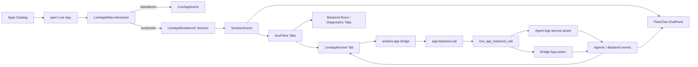

# Live App 复合交互形态设计方案

## 背景

当前 Live App 的默认运行形态是独立应用：用户从应用目录打开一个 Live App，`LiveAppScene` 挂载 `LiveAppRunner`，再由 iframe 内的 `window.app` bridge 调用宿主能力。这个形态适合表单、看板、画布、仪表盘和轻量工具。

但有一类 Live App 天然不是“一个独立界面完成全部工作”，而是“对话协作 + 专用工作面板”的组合。例如当前 Live App Studio 已经采用这种形态：左侧复用 FlowChat 会话，右侧自动打开配套的 Live App Builder 标签页，里面有预览、运行状态、诊断和快捷动作。

目标是让普通 Live App 也能声明并运行这种复合交互，而不是每个 Live App 都重做聊天界面、重写 agent 会话管理、重造右侧调试/预览面板。

本文先从第一性原理定义应如何分析，再给出产品与架构方案，并覆盖 Live App Studio 后续如何生成和调试这种 Live App。

## 当前事实

现有代码已经提供了几个关键支点：

- `src/web-ui/src/app/scenes/session/SessionScene.tsx` 已经是通用的左右布局：左侧 `ChatPane` 渲染 FlowChat，会话右侧是 `AuxPane` 和 ContentCanvas tabs。
- `src/web-ui/src/app/session-profiles/types.ts` 定义了 `SessionProfile`，其中 `layout.showChat`、`layout.defaultAuxPane`、`auxTabs.autoOpen`、`auxTabs.exclusiveTabTypes` 已经可以描述“左侧会话 + 右侧自动标签页”的交互骨架。
- `src/web-ui/src/app/session-profiles/profiles/liveAppStudioProfile.ts` 和 `agentAppStudioProfile.ts` 是现成样板：二者都展示了 profile 如何让会话自动打开右侧 Studio 面板。
- `src/web-ui/src/app/scenes/apps/live-app/components/LiveAppRunner.tsx` 已经把 Live App 放进 sandbox iframe，并通过 `useLiveAppBridge` 处理宿主调用。
- `src/web-ui/src/app/scenes/apps/live-app/hooks/useLiveAppBridge.ts` 已经支持 `backend.call`、`backend.status`、`backend.cancelRun`、`backend.onEvent`、`host.fillChatInput` 等能力；非私有 Agent App 后端会话还会注册到 `FlowChatStore.addExternalSession(...)`，具备被 FlowChat 观察的基础。
- `src/crates/core/src/live_app/types.rs` 已经有 `LiveAppBackendBinding`、`LiveAppBackendActionBinding`、`sessionPolicy`、`memoryScope` 等后端绑定模型。
- `src/crates/core/src/agentic/agents/prompts/live_app_studio_agent.md` 已经把 Live App 的智能后端约束为声明式 `backends + serviceActions + app.backend.call()`，而不是让 Live App UI 直接创建和管理任意 Agentic 会话。
- `docs/sparo-app-types-architecture.zh-CN.md` 已经明确：Live App 是用户体验层；Agent App 是 Sparo 原生 Agent 封装；Bridge App 是外部能力适配层；Live App 通过声明式后端调用 Agent App 或 Bridge App。

因此，这个方案不需要发明全新的聊天系统。正确方向是把 Live App Studio 的组合形态抽象成平台级“复合交互 surface”，让普通 Live App 通过 manifest 声明复用。

## 第一性原理

### 1. Live App 的本质是任务界面，不是 Agent 会话容器

Live App 应该负责用户眼前的工作对象：表单、列表、画布、审批流、报告、素材、状态、可视化和操作路径。它可以触发智能后端能力，但不应该把任意 Agent 会话生命周期、工具确认、模型轮次、会话历史、恢复和事件投影都搬进 iframe 里自己实现。

因此，复合形态中的对话区应由 FlowChat 承担。Live App 只声明“我需要哪类对话协作”和“右侧需要哪些工作面板”。

### 2. FlowChat 是可观察、可接管的协作面

用户需要知道 AI 在做什么、用了什么工具、是否卡住、是否需要确认、结果如何沉淀。FlowChat 已经承载这些能力：消息流、工具卡片、状态投影、输入框、会话持久化、恢复、取消和跳转。

如果 Live App 自己在 iframe 中实现聊天 UI，会出现三类问题：

- 产品体验割裂：同一类 AI 工作在不同 Live App 中表现不一致。
- 架构重复：每个 Live App 都要重复处理会话、流式事件、工具确认和异常恢复。
- 安全边界变弱：iframe 更容易绕过平台已有的可审计路径，变成自由拼接 prompt 或自由调用内部 API。

所以复合形态应该是“Live App 绑定一个 FlowChat 会话”，而不是“Live App 嵌入一个聊天组件”。

### 3. 右侧标签页是工作对象的投影视图

右侧 tab 不应该只是“额外容器”。它代表与当前会话同一个任务对象的不同投影：

- 主 Live App 面板：任务状态、可操作 UI、结构化结果。
- 运行/诊断面板：日志、错误、权限、后端 run 状态。
- 资源面板：文件、数据、输出 artifact、预览。
- 后端进度面板：Agent App service action 或 Bridge App run 的事件流。

这些 tab 应由宿主提供生命周期、尺寸、持久化和关闭策略。Live App manifest 只声明需要哪些受信任的 tab 类型和数据绑定，不能让 app 随意注入宿主 React 组件。

### 4. 智能能力必须结构化调用

复合 Live App 的智能后端应继续使用 `app.backend.call('<backendId>.<actionName>', input, options)`。这带来几个边界：

- Live App 通过结构化 input 触发业务动作，不解析自由聊天文本作为状态来源。
- Agent App 通过 `serviceActions` 暴露业务能力，如 `organizeConcern`、`draftReply`、`summarizeEvidence`，而不是暴露 `sendMessage`、`createSession` 这样的技术动作。
- Bridge App 负责外部系统适配，Agent App 负责把能力产品化，FlowChat 负责可观察执行。

### 5. 组合形态应是应用 manifest 能力，不是硬编码模式

当前 Studio profile 是特例实现。要让更多 Live App 支持这种形态，不能为每个 app 增加一个 `SessionProfileId`、一个 `PanelContentType` 和一组硬编码 cleanup 逻辑。平台需要一个通用 profile 和一个通用 Live App panel 类型，由 Live App manifest 决定具体右侧 tab。

## 产品方案

### 形态分层

Live App 应支持两类 launch mode：

1. **Standalone Live App**
   - 当前形态。
   - 打开后主要显示 `LiveAppRunner`。
   - 适合纯工具、仪表盘、小游戏、单页编辑器、展示型页面。

2. **Composite Live App**
   - 新形态。
   - 打开后进入一个会话场景：左侧是 FlowChat，右侧自动打开 Live App 配套 tab。
   - 适合需要 AI 协作、长流程、可观察后端执行、多轮修改、结构化结果沉淀的应用。

### Composite Live App 的默认布局

```text
┌───────────────────────────────┬─────────────────────────────────┐
│ FlowChat Session               │ Aux Tabs                        │
│                               │ ┌─────────────────────────────┐ │
│ - 用户意图                     │ │ Live App main panel          │ │
│ - AI 过程                      │ │ domain UI / preview / state  │ │
│ - 工具卡片                     │ └─────────────────────────────┘ │
│ - 确认与恢复                   │ tabs: App / Runs / Data / Logs   │
└───────────────────────────────┴─────────────────────────────────┘
```

默认规则：

- 左侧 FlowChat 始终是同一个任务/应用上下文的对话面。
- 右侧第一个 tab 是 Live App 主面板，复用 `LiveAppRunner`。
- 如果 app 声明了后端能力，右侧可以显示后端 run 状态、结构化输出、日志和诊断。
- 用户可以折叠左侧聊天，让右侧工作面板成为主视图；也可以折叠右侧，只保留对话。
- 从 Live App 主面板发起的智能动作，应在 FlowChat 中留下可观察执行记录。

### 典型使用场景

#### AI 工作台

用户打开一个“会议纪要工作台” Live App。左侧 FlowChat 负责与纪要 Agent 对话，右侧是结构化纪要编辑器、待确认行动项、引用材料和导出按钮。

#### 生成式编辑器

用户打开一个“PPT Live”类应用。左侧 FlowChat 展示生成过程、工具调用、失败恢复；右侧显示可编辑幻灯片预览、页面列表、导出和日志。

#### 数据/运营助手

用户打开一个“社区运营看板”。左侧通过 Agent App 解释指标变化并提出下一步动作；右侧显示指标卡、筛选器、分群表、行动清单。

#### 外部软件桥接前台

用户打开一个“Office 自动化面板”。左侧 FlowChat 可观察 Agent/Bridge 执行过程；右侧 Live App 提供文件选择、任务配置、进度和输出 artifact。

### 用户心智

用户不需要理解 Agent App、Bridge App、backend binding 或 session policy。产品文案可以把 Composite Live App 描述为：

- “带 AI 协作区的应用”
- “应用工作台”
- “左侧讨论，右侧操作”
- “可边聊边改的 Live App”

在 Apps 目录中，Composite Live App 可以显示一个轻量标识，例如“带协作会话”。但不要把它包装成新的应用类型。它仍然是 Live App，只是 launch mode 不同。

## 架构方案

### 总体架构



### 新增 manifest：`interaction`

在 `LiveApp` / `LiveAppMeta` 上新增可选字段 `interaction`。未声明时保持现有 standalone 行为。

```json
{
  "interaction": {
    "mode": "composite",
    "title": {
      "zh-CN": "会议纪要工作台",
      "en-US": "Meeting Notes Workbench"
    },
    "chat": {
      "backendId": "notes",
      "agentAppId": "meeting-notes-agent",
      "sessionPolicy": "perEntity",
      "memoryScope": "appInstance",
      "initialPromptKey": "chat.initialPrompt",
      "allowUserPrompt": true
    },
    "tabs": [
      {
        "id": "app",
        "type": "liveApp",
        "titleKey": "tabs.app",
        "default": true
      },
      {
        "id": "runs",
        "type": "backendRuns",
        "titleKey": "tabs.runs"
      },
      {
        "id": "diagnostics",
        "type": "liveAppDiagnostics",
        "titleKey": "tabs.diagnostics",
        "developerOnly": true
      }
    ]
  }
}
```

字段含义：

- `mode`: `standalone` 或 `composite`。
- `chat.backendId`: 默认绑定到哪个 Live App backend。它必须存在于 `backends` 中。
- `chat.agentAppId`: 可选冗余信息，用于目录展示和校验；实际调用仍以 `backends` 为准。
- `chat.sessionPolicy`、`chat.memoryScope`: 与后端绑定保持一致，用于决定是否复用会话。
- `chat.initialPromptKey`: 首次打开时可填入 FlowChat 的启动建议，不直接自动发送，除非用户或 manifest 明确允许。
- `tabs`: 右侧标签页声明，必须是宿主白名单类型。

### 通用 profile：`live-app-workbench`

新增一个平台级 profile，而不是为每个 Live App 建 profile。

建议新增：

- `SessionProfileId`: `live-app-workbench`
- `SessionIdentityId`: `live-app-workbench`
- `SessionHostKind`: 仍可归入 `agent-app` 或新增更精确的 `live-app-workbench`。如果要减少改动，先使用现有 `agent-app`，通过 descriptor metadata 识别 owner。
- `SessionProfile`: `showChat: true`、`defaultAuxPane: visible`、`chatCollapsible: true`、`canSwitchAgents: false`、`showWelcomePanel: false`。

关键点：这个 profile 的 `auxTabs.autoOpen` 不应该硬编码某个 Studio panel，而是读取当前 active session metadata 中的 `liveAppWorkbench` 数据，再生成通用 tab。

示意 metadata：

```json
{
  "liveAppWorkbench": {
    "appId": "meeting-notes",
    "interactionRevision": "rev-123",
    "tabs": [
      { "id": "app", "type": "liveApp", "title": "App" },
      { "id": "runs", "type": "backendRuns", "title": "Runs" }
    ]
  }
}
```

### 通用 panel 类型

当前 `PanelContentType` 里有 `live-app-studio` 和 `agent-app-studio` 这样的特定类型。Composite Live App 需要新增少量通用类型：

- `live-app-runner`: 在右侧 tab 中渲染某个 Live App 的 `LiveAppRunner`。
- `live-app-backend-runs`: 显示当前 app 的 backend action run 列表、状态、取消、重试和最近事件。
- `live-app-diagnostics`: 复用 Studio 里的 runtime issue/log 视图，开发态默认显示，普通用户可按权限或开关隐藏。
- 可选 `live-app-data-view`: 显示 app 声明的结构化数据、输出 artifact 或资源索引。

第一阶段只需要 `live-app-runner`，因为这已经能满足“左侧 FlowChat + 右侧 Live App 标签页”的核心体验。后续再逐步把 diagnostics 和 runs 从 Studio 专用面板里抽出来。

### 打开流程

Standalone 当前流程保持不变：

```text
openWorkspaceScene("live-app:<appId>")
-> LiveAppScene
-> LiveAppRunner
```

Composite 新流程：

```text
openLiveApp(appId)
-> liveAppAPI.getLiveApp(appId)
-> interaction.mode === "composite"
-> LiveAppWorkbenchService.ensureSession(app)
-> FlowChatManager.switchChatSession(sessionId)
-> SessionScene(surfaceSessionId=sessionId)
-> live-app-workbench profile auto-opens declared aux tabs
-> live-app-runner tab renders LiveAppRunner(app)
```

`ensureSession(app)` 的职责：

- 根据 `app.id + interactionRevision + entityId` 找到或创建 FlowChat session。
- 写入 session descriptor：`profileId = live-app-workbench`。
- 写入 session metadata：appId、tabs、backend binding、entityId、display title。
- 如果 manifest 声明了 `initialPromptKey`，把它作为输入框建议或 welcome prompt，不直接绕过用户发送。

### Live App 与 FlowChat 的协作

Live App iframe 不直接控制 FlowChat 内部状态，只通过受控 host API 表达意图：

已有能力：

- `app.backend.call(target, input, options)`: 触发后端 action。
- `app.backend.onEvent(fn)`: 接收后端事件。
- `app.host.fillChatInput(text)`: 把建议 prompt 填入宿主聊天输入框。

建议补充：

- `app.host.focusChat()`: 聚焦左侧 FlowChat 输入框。
- `app.host.openBackendSession({ sessionId })`: 打开/聚焦某个后端会话对应的 FlowChat 视图。
- `app.host.openPanel({ tabId })`: 聚焦 manifest 声明过的右侧 tab。
- `app.host.setPanelBadge({ tabId, status, count })`: 允许 Live App 给宿主 tab 提供轻量状态，但不能控制任意宿主 UI。

这些 API 都应经过 `useLiveAppBridge` 白名单分发，不能暴露通用 Tauri invoke 或内部服务入口。

### 后端 action 与会话可观察性

`live_app_backend_call` 已经负责把 Live App backend 调用转到 Agent App service action 或 Bridge App action。Composite 模式下需要增强前端投影：

- 对 Agent App backend：
  - 继续复用 ConversationCoordinator / DialogScheduler 创建或复用 session。
  - `FlowChatStore.addExternalSession(...)` 不只是“外部会话”，还应绑定到当前 workbench session metadata，作为可观察子会话或同源任务记录。
  - 如果 action 是长流程，FlowChat 中应显示相关工具卡片和模型输出。

- 对 Bridge App backend：
  - 保持 Bridge runtime 专用路径。
  - 把 Bridge events 进入 `liveapp-backend-event`，右侧 runs tab 和 Live App iframe 都能订阅。
  - 如果 Bridge action 包装在 Agent App service action 中，则 FlowChat 显示 Agent App 的解释、确认和结果。

### 状态持久化

建议新增一个轻量状态模型：

```ts
interface LiveAppWorkbenchBinding {
  appId: string;
  entityId?: string;
  sessionId: string;
  interactionRevision: string;
  tabState: {
    activeTabId?: string;
    closedTabIds?: string[];
  };
}
```

存储位置：

- session metadata：记录 appId、entityId、tabs 和 interaction revision，保证 FlowChat 恢复后可以恢复右侧 tab。
- Live App storage：继续保存 app 自己的业务状态。
- FlowChat session history：保存对话和工具事件。

不要把 Live App iframe 内部状态塞进 FlowChat history，也不要把 FlowChat transcript 复制进 Live App storage。

### 权限与安全

- Composite mode 不新增 Live App 的宿主权限。Live App 仍然只能通过 `window.app` 白名单调用能力。
- `tabs.type` 必须是宿主白名单，不支持 manifest 注入任意 React component。
- `chat.backendId` 必须指向 `backends` 中声明过的 backend。
- 对 workspace、shell、net、ai、bridge backend 的权限继续沿用已有权限体系。
- `app.host.*` 只能表达 UI 意图，不能读取聊天内容、不能枚举所有 session、不能调用任意内部 service。
- 后端 action 的业务结果应通过结构化 output 或 backend events 进入 Live App，不鼓励 Live App 解析自由聊天文本。

## Live App Studio 支持方案

Live App Studio 后续要能生成这种 Composite Live App，需要同时升级“理解、脚手架、预览、验证”四个环节。

### 1. Prompt 和任务判断

Studio 应增加一个产品判断：

- 如果用户要的是单一工具、看板、表单、可视化，默认 `standalone`。
- 如果用户描述了“边聊边改”“让 AI 协作处理”“右侧预览/工作台”“需要可观察执行过程”“长期任务/多轮迭代”，默认 `composite`。
- Studio 不问用户技术细节，不问 profile、session policy、bridge 细节；只在涉及隐私、外部访问、广泛文件读写时确认。

### 2. InitLiveApp 工具输入

`InitLiveApp` 可以新增可选字段：

```json
{
  "interactionMode": "standalone | composite",
  "defaultBackendId": "assistant",
  "tabs": ["liveApp", "backendRuns", "diagnostics"]
}
```

当 `interactionMode = composite`：

- 生成 `meta.json.interaction`。
- 如果需要智能后端，同时生成 `backends` binding 草案。
- 如果需要新的 Agent App service action，Studio 应引导用户转到 Agent App Studio 或调用对应工具生成 Agent App，而不是把复杂 agent prompt 写进 Live App UI。
- `source/ui.js` 中优先使用 `app.backend.call()`，而不是 `app.ai.chat()` 或自建聊天 UI。

### 3. Studio 预览面板

当前 Live App Studio 右侧面板只预览 `LiveAppRunner` 和 diagnostics。后续应提供两个预览模式：

- `App Preview`: 只看 iframe 内 Live App 主界面。
- `Workbench Preview`: 用当前 Studio 会话模拟真实 Composite launch，左侧 FlowChat 保持当前 builder 会话，右侧打开 app 声明的 tabs。

第一阶段可以不做完整模拟，只要在 Studio 面板中显示：

- 当前 app 的 `interaction.mode`。
- 将打开的默认 tab。
- 绑定的 backend/action。
- 一个“Open as Workbench”按钮，走真实打开流程验证。

### 4. 运行验证工具

现有 `LiveAppRecompile`、`LiveAppRuntimeProbe`、`LiveAppClearRuntimeIssues`、`LiveAppScreenshotMatrix` 主要验证 iframe 和 runtime issue。Composite mode 需要新增验证维度：

- 是否能创建或恢复 workbench session。
- 是否能自动打开 manifest 声明的右侧 tab。
- `live-app-runner` tab 是否能加载 iframe。
- `app.backend.call()` 是否能发起 action，并在 FlowChat 或 backend event stream 中可观察。
- `app.host.fillChatInput()` / `focusChat()` 等 host UI 意图是否生效。

可以新增 `LiveAppWorkbenchProbe`，或者扩展 `LiveAppRuntimeProbe`：

```json
{
  "appId": "meeting-notes",
  "mode": "workbench",
  "includeBackendEvents": true
}
```

### 5. 生成代码约束

Studio 在生成 Composite Live App 时应遵守：

- 不在 iframe 内生成完整聊天窗口。
- 不用 `app.ai.chat()` 模拟 Agent App 能力，除非用户明确要直接模型文本生成。
- 不直接创建 raw Agentic session。
- 所有智能业务动作使用 `backends` + `app.backend.call()`。
- iframe UI 聚焦在结构化状态、用户操作、输出编辑、预览、配置和结果确认。
- 可见文本继续走 zh-CN + en-US i18n。

## 分阶段落地

### Phase 1：最小可用 Composite launch

目标：普通 Live App 可以声明 `interaction.mode = composite`，打开后左侧是 FlowChat，右侧是 Live App 主面板。

改动：

- 扩展 `LiveApp` / `LiveAppMeta` 类型，增加 `interaction`。
- 新增通用 `live-app-workbench` session profile。
- 新增 `live-app-runner` panel content type。
- 新增 `LiveAppWorkbenchService.ensureSession(app, entityId?)`。
- Apps 目录打开 Live App 时根据 `interaction.mode` 分流。
- profile auto-open 从 session metadata 读取 tabs 并打开 `live-app-runner`。

验证：

- 打开 standalone app 行为不变。
- 打开 composite app 后右侧显示同一个 Live App iframe。
- 关闭/切换会话后右侧 tab 生命周期正确。
- 刷新或恢复 session 后 tab 可恢复。

### Phase 2：后端 action 可观察

目标：Composite Live App 的 `app.backend.call()` 与左侧 FlowChat、右侧 runs tab 形成闭环。

改动：

- 将 backend action run 与 workbench session 绑定。
- 抽出 `live-app-backend-runs` panel。
- 后端 events 同时投递给 iframe、runs tab 和 FlowChat 投影。
- 为 `backend.call` 增加 entityId/idempotencyKey 推荐用法，支持 per-entity workbench。

验证：

- Agent App service action 触发后，FlowChat 可看到执行过程。
- Bridge App action 触发后，runs tab 可看到事件和状态。
- 取消、重试、错误恢复路径清晰。

### Phase 3：Studio 生成与调试

目标：Live App Studio 能识别、生成、预览、修复 Composite Live App。

改动：

- 更新 Live App Studio prompt。
- 扩展 `InitLiveApp` 输入和输出。
- Studio Panel 显示 interaction summary。
- 新增或扩展 runtime probe，覆盖 workbench launch。
- 示例 app 或内置 app 增加一个 Composite 样板。

验证：

- 用户一句话能生成 composite app 草案。
- Studio 不生成重复聊天 UI。
- Runtime probe 能发现 tab 未打开、backend 未声明、事件未转发等问题。

### Phase 4：通用 surface 化

目标：把 Studio 当前特例逐步迁移到同一套机制，减少 profile/panel 特判。

改动：

- 将 Live App Studio/Agent App Studio 中可通用的右侧 panel 逻辑抽为 manifest-driven tab。
- 清理 `usePanelTabCoordinator` 中针对特定 tab 类型的 cleanup 特判，改成 profile/metadata 驱动。
- 让 app surface model 与 `docs/sparo-app-types-architecture.zh-CN.md` 中的 surface 概念对齐。

## 设计边界

不做：

- 不在 Live App runtime 中暴露通用 Sparo OS backend 通道。
- 不让 Live App iframe 直接读写任意 FlowChat session。
- 不让 app manifest 注入任意宿主 React 组件。
- 不把 Composite Live App 定义成第四种应用类型。
- 不为每个 Live App 新增一个硬编码 profile。

要做：

- Live App 继续作为用户体验层。
- Agent App / Bridge App 继续作为后端能力层。
- FlowChat 继续作为 AI 协作和执行可观察层。
- SessionProfile / AuxPane / PanelContent 成为复合 surface 的宿主框架。
- Live App Studio 通过 manifest 和验证工具生成这种形态。

## 关键开放问题

1. `SessionProfileId` 目前是静态 union。短期可以增加一个 `live-app-workbench`，长期是否要允许动态 app-defined profile id，需要另行评估。
2. `PanelContentType` 目前也是静态 union。建议短期只加少量通用 Live App panel 类型，避免变成任意插件系统。
3. backend action 的 FlowChat 投影应显示在 workbench 主会话里，还是作为子会话/外部会话并可跳转，需要结合现有 `addExternalSession` 行为做一次交互走查。
4. 普通用户是否默认看到 diagnostics tab，应区分开发态、内置 app、用户生成 app 和发布 app。
5. 如果一个 Composite Live App 有多个 entity，例如多个客户、多个文档、多个项目，session 复用策略应以 `entityId` 为主，避免所有对象混进同一条 FlowChat。

## 推荐结论

用一个通用的 **Live App Workbench** 机制承接新交互形态：

- Live App manifest 声明 `interaction.mode = composite`。
- 宿主打开一个 `live-app-workbench` FlowChat session。
- 右侧根据 manifest 自动打开 `live-app-runner` 等受信任 tab。
- Live App iframe 通过 `app.backend.call()` 触发 Agent App 或 Bridge App 后端。
- FlowChat 负责对话、工具事件、确认、恢复和可观察性。
- Live App Studio 后续生成这种 app 时，只生成任务界面和 backend binding，不生成重复聊天系统。

这样既保留 Live App 的交互自由度，又把 AI 协作和平台执行能力留在 Sparo OS 已有的 FlowChat/Agentic 架构里。
