# Remotion Live App 最终形态与落地计划

## 目标边界

Remotion Live 的最终目标不是在 Sparo OS 里做一个“全局 Remotion 项目自动弹窗”，也不是把 Remotion Studio 复制成一个复杂 IDE。它应该是一个用户主动打开后的 Remotion 视频协作面板：

```text
用户打开 Remotion Live App
-> App 读取当前 workspace
-> App 内识别是否是 Remotion 项目
-> 绑定 composition / frame / preview host
-> 用户在右侧预览中选择画面元素
-> FlowChat 基于这个视觉上下文协作修改
```

因此本文的最终方案有三个硬边界：

- 自动识别只发生在 Remotion Live App 已经打开的前提下，不监听 workspace activation 去主动打开 App。
- 右侧区域基本固定为 Preview，不扩展成 `Inspector / Assets / Runs / Diagnostics / Changes` 多标签工作台。
- 新增能力的核心是“选中视频元素作为上下文”，而不是堆叠诊断、资产管理、运行历史等重功能。

## 用户第一性原理

### 1. 用户已经表达了意图：我要处理 Remotion

当用户打开 Remotion Live App 时，他不是在等待系统猜测要不要启动一个视频工具，而是已经进入了视频协作任务。此时最有价值的是尽快回答：

- 当前 workspace 是不是 Remotion 项目？
- 能不能马上看到 composition？
- 当前画面里我想改的是哪一块？
- Agent 能否理解“这里”“这个元素”“这一段”具体指什么？

所以检测逻辑应该是 App 内启动流程的一部分，而不是宿主层面的全局自动打开机制。

### 2. 右侧预览是产品主体，不是信息导航

Remotion 用户最关心的是画面变化。右侧面板应该稳定承载视频预览、composition 切换、frame 控制、播放控制和元素选择。额外信息只能作为预览的辅助层存在：

- 状态条：项目是否识别、preview 是否 ready。
- 轻量 context tray：当前 composition、frame、选中区域。
- 错误提示：preview/render 失败时 inline 显示简短原因和重试入口。

不应该为了“看起来完整”把右侧拆成多个工具页。多页会稀释最重要的反馈环：看见、指出、修改、再看见。

### 3. 视频协作里最难的是“指代”

用户说“把这个标题更高级”“这里节奏太慢”“这个图标换一下”时，真正的问题不是自然语言，而是指代缺失。最佳形态必须让用户能在预览中直接选择：

- 一个点。
- 一个矩形区域。
- 一个被识别出的可编辑元素。
- 一个 timeline 区间或 sequence hint。

这比增加更多诊断页面更重要，因为它直接减少 Agent 修改错误对象的概率。

### 4. Agent 需要窄而准的上下文

Agent 不需要默认接收整个项目的所有资产、日志和 diff。它首先需要当前协作闭环的事实：

- `workspacePath`
- `entryPoint`
- `compositionId`
- `frame`
- `fps`
- `durationInFrames`
- `width` / `height`
- `previewMode`
- `selectedVideoContext`
- 最近一次 preview/render 的关键错误

上下文越贴近当前画面和选中对象，Agent 越像视频协作者，而不是泛用代码助手。

### 5. Runtime 仍然属于 Bridge App

Live App iframe 不应该直接启动 Remotion Studio、跑 renderer、读本地文件或改源码。它只负责 UI、选择状态和结构化上下文发送。Remotion runtime 能力仍由 Bridge App 统一提供：

- 项目检测。
- composition manifest。
- Player / Studio preview host。
- 单帧渲染。
- 导出。
- 最小错误摘要。

## 当前实现基线

当前仓库已经有可用基础：

- `bundles/live-apps/remotion-live/meta.json` 已声明 `interaction.mode = composite` 和单个 `/preview` tab。
- Remotion Live UI 当前只有 `ROUTES = new Set(['/preview'])`，这与“右侧固定预览”的方向一致。
- Live App 已通过 `app.backend.call()` 调用 `remotionRuntime`，并通过 `host.fillChatInput()` 把上下文发送到 FlowChat。
- `remotionRuntime` 已声明 `detectProject`、`compileProject`、`getCompositionManifest`、`getFrameContext`、`ensurePlayerPreviewHost`、`ensurePreviewServer`、`renderStill`、`startExport` 等动作；`evaluateFrame` 仅作为 Bridge 内部兼容 action 保留。
- Preview 侧已有 composition、frame、Player、Studio iframe、still render、export 的基础状态。

审视时发现的主要 gap 是：

- 设计文档原方案过度扩大了宿主级自动打开和多 tab 诊断工作台，不符合当前产品边界。
- 项目识别应明确收敛为 Remotion Live App 打开后的内部绑定流程。
- `Send context` 目前主要是自然语言 prompt，缺少结构化的选中视频元素上下文。
- Preview 中还没有面向画面元素的选择层、选择状态和上下文 payload。
- 审视时 `remotion-video-agent` 只在 manifest 中被引用，需要补成真正的 Agent App package。
- `LiveAppInteractionTab.route` 仍需与 Rust / TS / manifest 对齐，避免 route 传递靠兜底逻辑。

## 本次落地补充

本次实现按“专属工具走 Agent App runtime tool，不进入 core 内置工具”的原则补齐：

- 新增 `bundles/agent-apps/remotion-video-agent/`，以 Agent App package 形式分发 Remotion Video Agent。
- Remotion Agent 的系统提示使用 `agent.md`，与 `AgentAppManager::AGENT_APP_PROMPT` 保持一致。
- Remotion 专属工具放在 `tools/*.tool.json` + `tools/*.js`，实际注册名是 `agentapp__remotion-video-agent__*`。
- 这些工具只做输入归一化和 `bridgeCall` 薄包装，实际 Remotion project、preview、render、export 仍由 `builtin-remotion-runtime` 的 `sparo.videoEngine` capability 承担。
- `AgentAppManager` 补齐 `bundles/agent-apps` seeding、project-level Agent Apps、workspace-aware runtime tool 注册，以及 JS runtime tool `bridgeCall` 的 `bridgeCapabilities` 校验。
- Live App workbench session 会读取 `interaction.chat.agentAppId`，因此 Remotion Live 右侧 chat 实际使用 `remotion-video-agent`，不是通用 `agentic`。
- `LiveAppInteractionTab.route` 已进入 Rust 类型契约，`/preview` route 不再只靠前端 fallback。
- Remotion Live Preview 增加 selection overlay：Player host 会把真实渲染 DOM 的 bounds/tag/label 作为 `frameContext` 回传，Live App 优先使用运行时实测元素，Bridge `getFrameContext` 的静态 layer 只作为未 ready / 非 Player 模式的兜底。

## 最终产品形态

Remotion Live 是一个单 Preview 右侧面板的 Composite Live App：

```text
┌──────────────────────────────┬────────────────────────────────────────┐
│ FlowChat                     │ Remotion Live Preview                  │
│                              │                                        │
│ - 用户意图                   │ Top bar: project / composition / mode  │
│ - Agent 计划与修改说明       │ Stage: Player or Studio preview        │
│ - 工具执行过程               │ Overlay: element/region selection      │
│ - 验证结果                   │ Timeline: frame and playback controls │
│                              │ Context tray: selected video context   │
└──────────────────────────────┴────────────────────────────────────────┘
```

### 右侧固定为 Preview

`meta.json.interaction.tabs` 最终只保留一个用户可见 tab：

| id | route | 类型 | 作用 |
| --- | --- | --- | --- |
| `preview` | `/preview` | `liveAppWorkbenchTab` | 默认且唯一的 Remotion Live 工作面板，承载预览、播放、frame、composition、选中元素上下文。 |

不新增 `inspector`、`assets`、`runs`、`diagnostics`、`changes` 等 tab。必要信息以内联方式出现在 Preview：

- composition metadata 放在紧凑 header 或 context tray。
- preview/render 错误放在 stage 内状态层。
- export 状态放在当前按钮和轻量 toast/status line。
- 最近修改文件由 FlowChat 工具卡或 Agent 回复承载。

### Preview 模式

Preview 可以有多个内部模式，但产品表面仍是同一个 `/preview` route。

| 模式 | 定位 | 默认性 |
| --- | --- | --- |
| `Player` | App-owned playback、frame sync、选择 overlay、给 Agent 提供稳定上下文。 | 推荐默认。 |
| `Studio` | 使用 Remotion Studio server 做开发态实时预览和 HMR。 | 可切换或在项目支持时辅助打开。 |
| `Still` | 低成本单帧验证和 fallback。 | 非主模式。 |

为了支持“选中视频元素作为上下文”，`Player` 应成为最稳定的交互承载层；`Studio` 更适合作为开发态预览源，但不假设可以可靠读取 iframe 内部 DOM。

## App 内自动识别规则

自动识别只在 Remotion Live App 已打开时发生。

```text
Remotion Live App mounted
-> 读取 host 传入的 workspacePath
-> remotionRuntime.detectProject({ workspacePath })
-> notFound: 在 Preview 内显示空态，不打开新 session，不弹全局提示
-> ambiguous: 在 Preview 内显示 entry 选择，不离开当前 App
-> broken: 在 Preview 内显示最小可恢复错误
-> matched: 绑定 project，读取 manifest，启动 preview
```

这条规则替代“workspace activated -> 自动创建或恢复 Remotion workbench session”。用户是否打开 Remotion Live App，由 Apps 入口、sidecar action、命令或现有 session 恢复决定，不由 detector 主动打扰。

### 检测输出

`detectProject` 应输出足够让 Preview 绑定项目的信息：

```ts
type RemotionDetectionStatus = 'matched' | 'ambiguous' | 'notFound' | 'broken';

interface RemotionProjectDetection {
  status: RemotionDetectionStatus;
  confidence: number;
  workspacePath: string;
  projectName?: string;
  packageManager?: 'npm' | 'pnpm' | 'yarn' | 'bun';
  entryPoints: Array<{
    path: string;
    source: 'registerRoot' | 'config' | 'script' | 'compositionUsage';
    confidence: number;
  }>;
  selectedEntryPoint?: string;
  remotionVersion?: string;
  hasNodeModules: boolean;
  missingDependencies: string[];
  errorSummary?: string;
}
```

### 检测 UX

- `matched`: 自动进入 Preview ready/loading 状态。
- `ambiguous`: 在 header 下方显示 entry picker，让用户选择入口。
- `broken`: 显示最短错误、缺失依赖、重试按钮；不展开完整诊断页。
- `notFound`: 显示“当前 workspace 不是 Remotion 项目”的空态。

## 选中视频元素作为上下文

这是本方案最重要的新能力。

### 选择模型

Preview stage 增加 `SelectionOverlay`，支持四种上下文粒度：

| 类型 | 触发 | 说明 |
| --- | --- | --- |
| `point` | 单击画面 | 表示“这里”。 |
| `region` | 拖拽框选 | 表示“这一块”。 |
| `element` | 命中可识别元素 | 表示具体标题、图片、按钮、图标、视频层等。 |
| `timeRange` | 拖拽 timeline 区间 | 表示“这一段”。 |

其中 `point` 和 `region` 必须总是可用。`element` 是增强能力，不能依赖所有 Remotion 项目都主动埋点。

### 元素识别策略

Remotion 的画面本质是 React 渲染结果，普通项目不会天然暴露“这是标题组件”“这是 Logo 图片”。因此元素识别采用渐进策略：

1. `Player` host 内部可控时，优先读取可见 DOM 的 bounding box、tag、text snippet、asset src。
2. 如果项目使用可选约定，例如 `data-sparo-remotion-id`、`data-sparo-label`、`data-sparo-role`，则生成高置信 element context。
3. 如果无法拿到语义元素，则退化为 normalized region context，并附带当前 frame still snapshot。
4. `Studio` iframe 模式下默认只支持 overlay point/region，不把跨 iframe DOM introspection 作为硬依赖。

### Context payload

`Send context` 最终发送结构化 payload，而不是只拼自然语言：

```ts
interface RemotionSelectedVideoContext {
  kind: 'remotion-video-selection';
  workspacePath: string;
  entryPoint: string;
  compositionId: string;
  frame: number;
  timeSeconds: number;
  fps: number;
  durationInFrames: number;
  size: { width: number; height: number };
  previewMode: 'player' | 'studio' | 'still';
  selection?: {
    type: 'point' | 'region' | 'element' | 'timeRange';
    normalizedBox?: { x: number; y: number; width: number; height: number };
    point?: { x: number; y: number };
    frameRange?: { from: number; to: number };
    element?: {
      id?: string;
      role?: string;
      label?: string;
      textSnippet?: string;
      assetPath?: string;
      sourcePath?: string;
      confidence: number;
    };
  };
  previewError?: string;
  snapshot?: {
    kind: 'still';
    artifactPath?: string;
    dataUrl?: string;
  };
}
```

短期兼容当前宿主能力时，Live App 可以继续调用 `host.fillChatInput()` 生成可读 prompt；但最终应增加通用的 structured context attachment，让 FlowChat 和 Agent App 都能读取同一份 payload。

### 用户可见交互

- 未选择时，`Send context` 发送当前 composition/frame。
- 选择后，按钮文案可仍叫“发送上下文”，但上下文摘要显示为：`SparoOSPromo-16x9 · frame 120 · selected region 32% x 18%`。
- 选择框常驻在 preview stage 上，可清除、重选、发送。
- Agent 回复里应引用用户选择，例如“我会调整你框选的标题区域”，而不是泛泛说“我会修改视频”。

## 最终架构

```mermaid
flowchart LR
  User["User opens Remotion Live App"] --> Host["Live App host passes workspacePath"]
  Host --> LiveUI["builtin-remotion-live /preview"]
  LiveUI --> Detect["remotionRuntime.detectProject"]
  Detect --> Bind["bind project + composition"]
  Bind --> Preview["Player or Studio preview"]
  Preview --> Selection["SelectionOverlay"]
  Selection --> Context["RemotionSelectedVideoContext"]
  Context --> Chat["FlowChat context attachment"]
  Chat --> Agent["remotion-video-agent"]
  Agent --> Bridge["builtin-remotion-runtime"]
  Bridge --> Preview
```



### 三层责任

| 层 | 名称 | 责任 |
| --- | --- | --- |
| Live App | `builtin-remotion-live` | Preview UI、composition/frame 控制、选择 overlay、context tray、调用 backend actions。 |
| Bridge App | `builtin-remotion-runtime` | 项目检测、manifest、preview host、still/export、最小错误摘要。 |
| Agent App | `remotion-video-agent` | 基于当前 frame 和 selected video context 解释、计划、修改、验证。 |

宿主 Web UI 只需要保证 composite Live App、route、workspacePath、backend bridge 能稳定工作，不引入 Remotion 专用全局 auto-open service。

## 最终目录与命名

### Live App bundle

当前 `ui.js` 可以继续作为过渡入口，但最终应拆成以 Preview 和 Context 为中心的目录：

```text
bundles/live-apps/remotion-live/
  meta.json
  source_manifest.json
  index.html
  worker.js
  src/
    ui/
      index.js
      RemotionLiveApp.js
      state.js
      i18n.js
    preview/
      PreviewWorkbench.js
      PreviewStage.js
      PreviewModeSwitch.js
      CompositionPicker.js
      FrameControls.js
      Timeline.js
      SelectionOverlay.js
      ContextTray.js
    services/
      backendClient.js
      projectBinding.js
      previewHost.js
      selectedVideoContext.js
    styles/
      index.css
      preview.css
      selection.css
```

命名原则：

- `PreviewWorkbench` 是唯一主视图。
- `SelectionOverlay` 只负责选择交互。
- `selectedVideoContext` 只负责生成结构化上下文。
- 不引入 `InspectorView`、`DiagnosticsView`、`RunsView` 等页面级概念。

### Bridge App bundle

Bridge 仍然应从单文件逐步拆分，但围绕 Remotion Live 的必要动作，不扩展成通用运维面板：

```text
bundles/bridge-apps/remotion-runtime/
  worker.js
  src/
    index.js
    actions/
      detectProject.js
      getCompositionManifest.js
      getFrameContext.js
      ensurePlayerPreviewHost.js
      ensureStudioPreviewHost.js
      renderStill.js
      startExport.js
    remotion/
      cli.js
      metadata.js
      playerHost.js
      studioServer.js
      frameContext.js
    workspace/
      signals.js
      paths.js
```

兼容旧 action：

- `compileProject` -> `getCompositionManifest`
- `evaluateFrame` -> `getFrameContext`
- `ensurePreviewServer` -> `ensureStudioPreviewHost`

### Agent App bundle

`remotion-video-agent` 应成为随产品分发的 Agent App package，而不是 core 内置 Agent 或 core 内置 Tool。它不是一段更长的 system prompt，而是一个围绕 Remotion 视频开发闭环组织的专属 Agent package：

```text
bundles/agent-apps/remotion-video-agent/
  manifest.json
  agent.md
  routing.md
  examples.json
  schemas/
    selected-video-context.schema.json
    agent-action-input.schema.json
    agent-action-output.schema.json
  skills/
    remotion-fundamentals.md
    video-development-workflow.md
    composition-architecture.md
    motion-timing.md
    visual-design.md
    media-assets.md
    selected-context.md
    validation-export.md
  tools/
    detect_project.tool.json
    detect_project.js
    get_composition_manifest.tool.json
    get_composition_manifest.js
    get_frame_context.tool.json
    get_frame_context.js
    refresh_preview.tool.json
    refresh_preview.js
    render_still.tool.json
    render_still.js
    start_export.tool.json
    start_export.js
  evals/
    cases.json
```

目录原则：

- `manifest.json` 只声明 Agent 身份、触发场景、service actions、基础 tools、runtime tools 和 bridge capability 依赖。
- `agent.md` 保持短，只定义角色边界、工作循环和安全规则。
- `routing.md` 定义如何根据用户意图和 context 选择内部 skill。
- `schemas/` 定义结构化上下文和 action 输入输出，避免靠自由文本传事实。
- `skills/` 是 Agent 的渐进式知识包，按 Remotion 视频开发能力组织，不按“选区上下文”或代码文件类型组织。
- `tools/` 只放 Agent App JavaScript runtime tools，用于 Remotion 领域薄包装；不得实现通用搜索/读写，也不得承担 Bridge App 的长进程职责。
- `evals/` 保存少量可回放任务，用于验证 Agent 是否真的按 Remotion 方式工作。
- 不增加 README、安装指南、长篇背景文档等不能直接提升 Agent 执行质量的文件。

Agent service actions 保持少而准：

| action | 作用 |
| --- | --- |
| `understandVideoProject` | 检测项目、读取 composition manifest，并定位候选源码。 |
| `reviseVideoComposition` | 基于 brief、composition、frame、源码事实和可选选区修改 Remotion 源码。 |
| `renderReviewArtifact` | 触发 still/frame/export 验证并总结结果。 |

## 专属 Agent 设计

### Agent 设计第一性原理

Remotion Video Agent 的本质不是“带 Remotion 知识的聊天助手”，也不是“只围绕当前选区行动的上下文修补器”。它应该是一个视频开发协作者：

```text
video development philosophy + Remotion mental model + concise instructions + typed tools + validation loop
```

Remotion Video Agent 必须满足这些原则：

1. 视频先于代码。
   - 用户要的是一段可观看、可修改、可导出的视频，不是漂亮的 React diff。
   - Agent 的每次判断都要回到画面、时间、节奏、构图、资产和渲染结果。
2. Remotion 的基本心智模型是“React over time”。
   - `Composition` 定义可渲染视频单位。
   - `frame` 是时间的基础货币。
   - `Sequence` / `Series` 是时间结构。
   - 动效必须由 frame 驱动，不能依赖浏览器运行时动画。
3. system prompt 应短而强。
   - 描述好结果、关键约束、工具边界和输出格式。
   - 不把所有 Remotion 知识塞进 system prompt；细节通过 skills 和工具上下文渐进加载。
4. 工具要按副作用分级。
   - 读项目、读 manifest、读 frame context 是低风险。
   - 修改源码、刷新 preview 是中风险。
   - 安装依赖、导出长视频、改全局 composition 契约是高风险，需要确认或 guardrail。
5. 上下文是输入之一，不是 Agent 的全部世界。
   - `RemotionSelectedVideoContext` 很重要，但它只是高精度指代工具。
   - 没有 selection 时，Agent 仍应能基于 brief、composition、timeline、源码和 preview 进行视频开发协作。
6. 修改必须可验证。
   - 每次重要修改都要说明 visual hypothesis。
   - 能预览就刷新 preview，能低成本验证就 render still。
   - 不能验证时要诚实说明不确定性。

### 借鉴的 skill 组织方式

Remotion Video Agent 的内部 skill 参考通用 AI skill 和 agent 设计中的几条成熟做法：

- 用 `name + description` 做触发入口，让系统能在正确任务加载正确 skill。
- `agent.md` 只放核心行为和约束，详细领域知识放进 `skills/`。
- 每个 skill 有明确输入、输出和不做什么，避免变成一本百科。
- 工具 schema 和 skill 输入输出保持结构化，避免把事实埋进自然语言。
- 通过 evals 验证 skill 是否能在真实任务中触发、执行和退出。
- 对高风险动作使用低自由度流程，例如 render validation；对审美方案保留高自由度。

结合 Remotion 特点后，Agent skill 不应按“React、CSS、文件、命令”组织，也不应只按“选区上下文”组织。最终应按 Remotion 视频开发能力组织：

| skill | 触发场景 | 核心知识 |
| --- | --- | --- |
| `remotion-fundamentals.md` | 判断项目结构、解释 Remotion 基本概念。 | `Composition`、`Still`、`Folder`、entry、Remotion config、renderability。 |
| `video-development-workflow.md` | 用户提出完整视频开发任务。 | brief -> inspect -> plan -> edit -> preview -> validate -> summarize。 |
| `composition-architecture.md` | 新增、拆分或重构 composition/component。 | `defaultProps`、`calculateMetadata`、尺寸、fps、duration、props 契约。 |
| `motion-timing.md` | 调整节奏、入场、退场、卡点、转场。 | `frame`、`useCurrentFrame()`、`useVideoConfig()`、`Sequence`、`Series`、local frame、`interpolate()`、`Easing.bezier()`。 |
| `visual-design.md` | 改排版、层级、品牌感、动效质感。 | 视觉层级、空间、typography、motion intent、可渲染 CSS-in-React。 |
| `media-assets.md` | 图片、视频、音频、字体、字幕和数据资产。 | `public/`、`staticFile()`、`Img`、`Video`、`Audio`、trim、volume、playbackRate。 |
| `selected-context.md` | 用户点选/框选预览对象。 | point/region/element/timeRange 如何辅助定位，但不取代完整任务理解。 |
| `validation-export.md` | 修改后验证或导出。 | preview refresh、still render、关键 frame、export 约束和失败处理。 |

### System Prompt 草案

`agent.md` 建议使用英文。它是内部 Agent prompt，不是用户界面文案；保持短、强、结果导向，避免把每个 Remotion API 细节塞进去。

```text
You are Remotion Video Agent, a senior creative developer for Remotion projects.

Your job is to help users design, edit, explain, and validate videos built with Remotion. Treat every task as video development first and React code editing second. Optimize for a visible, renderable result: composition, timing, motion, layout, media, and export must stay coherent.

Core mental model:
- A Remotion project is React over time.
- A Composition or Still is the renderable unit.
- Frames are the source of truth for time.
- Sequence and Series define temporal structure.
- Animation must be driven by useCurrentFrame() and useVideoConfig(), not CSS transitions, CSS animations, or Tailwind animation classes.
- Local frames inside Sequence are not global composition frames.
- Assets from public/ must be referenced with staticFile().
- Preview or render output is stronger evidence than your own explanation.

Collaboration style:
- Be a capable video collaborator, not a passive code assistant.
- When the user intent is clear, inspect the minimum needed context and act.
- Ask a short clarifying question only when ambiguity would likely cause the wrong video change.
- Use selected preview context when available, but do not require it for every task.
- Explain choices in video terms: frame, timing, rhythm, composition, hierarchy, motion, media, and validation.
- Keep user-facing updates concise and concrete.

Operating loop:
1. Understand the user’s video goal and current project state.
2. Inspect the smallest necessary project, composition, frame, source, or asset context.
3. Form a concise edit plan when the change is non-trivial.
4. Edit the minimal necessary files.
5. Refresh preview or render still frames when validation is available.
6. Report changed files, visual intent, validation result, and the next useful step.

Tool policy:
- Use metadata and source-reading tools before editing.
- Use the host's existing source tools for search, read, edit, and diff; do not invent app-specific workspace tools.
- Use Agent App runtime tools for Remotion-specific reusable operations; those tools may call the Remotion Bridge runtime through declared capabilities.
- Do not start arbitrary processes, install dependencies, delete many files, or change global composition contracts without explicit approval.
- If a tool fails, summarize the failure and choose the smallest recovery path.

Output policy:
- For explanations, answer in the user’s language.
- For plans, include target composition, intended visual change, files to inspect or edit, and validation frames.
- For edits, include changed files, expected visual result, and validation status.
- Never claim a visual change was verified unless preview or render evidence was actually obtained.
```

### 工具设计

#### 当前机制分析

当前代码里已经有“Agent 在运行时自定义扩展工具”的路径，不应该再把 Remotion 专属工具做成 core 内置工具：

- Agent App package 支持 `tools/*.tool.json` + JavaScript entry。`CreateAgentAppJsTool` 创建工具，`TestAgentAppJsTool` 运行代表性输入，`AgentAppManager::register_runtime_tools()` 在启动或更新后把工具注册到全局 tool registry。
- 运行时工具实际名称会带命名空间：`agentapp__<appId>__<toolName>`，例如 `agentapp__remotion-video-agent__get_frame_context`。这避免和内置工具或其他 Agent App 工具冲突。
- JS runtime tool 可以通过 `context.fs`、`context.shell`、`context.net`、`context.storage` 做受权限约束的轻量领域逻辑；也可以返回 `bridgeCall`，由 `AgentAppRuntimeToolAdapter` 代为调用 Bridge App。
- 通用 `BridgeCall` 工具已经会检查 Agent App manifest 是否声明了对应 `bridgeCapabilities`；JS runtime tool 的 `bridgeCall` 路径也应保持同样的声明校验。
- `builtin-remotion-runtime` 已是 Bridge App，声明了 `sparo.videoEngine` capability，且 `usableBy` 包含 `agentApp`。所以 Remotion 进程、preview、render、export 的重活仍属于 Bridge App，不应搬进 Agent App JS tool。

机制缺口：

- `AgentAppLevel::Project` 和 `<workspace>/.sparo_os/agent_apps/` 路径已存在，但当前 `AgentAppManager` 的 list/get/register/load 主要强制 user-level，`workspace_root` 多处被忽略。若 Remotion Agent 要随项目提供或在项目内覆写，需要完善 project-level Agent App 注册。
- built-in Agent Apps 的通用 bundle seeding 还不完整；当前 seed 逻辑偏向旧的 file agent app。`bundles/agent-apps/remotion-video-agent` 应通过 Agent App package 机制 seed/install，而不是写成 core 内置 Agent 或内置 tool。
- JS runtime tool 返回 `bridgeCall` 时需要校验该 Agent App manifest 是否声明对应 bridge capability，和 `BridgeCall` 工具一致。
- Agent App manifest 的 `tools` 需要能引用自己 package 内 runtime tool；创建/更新 runtime tool 后要自动注册并确保可在该 Agent App 的 capability profile 中出现。

因此最终实现路线是：

```text
基础工具: LS / Glob / Grep / Read / Edit / Write / GetFileDiff / Bash
Remotion 专属工具: Agent App JS runtime tools under remotion-video-agent/tools/
重型 Remotion runtime: builtin-remotion-runtime Bridge App
桥接方式: JS runtime tool returns bridgeCall, or Agent uses BridgeCall with declared bridgeCapabilities
```

Agent 工具应围绕“理解项目 -> 修改源码 -> 验证视频”组织，但不能为通用文件能力再造一套 `workspace.*` 工具。搜索、读文件、编辑、diff、命令执行都复用 Sparo 现有基础工具；Remotion Agent 只通过 Agent App runtime tool 机制增加 Remotion 领域薄工具。

基础工具 allowlist：

| tool | 风险 | 作用 | 说明 |
| --- | --- | --- | --- |
| `LS` | 低 | 查看目录形状。 | 用于确认项目结构，不代替搜索。 |
| `Glob` | 低 | 按文件模式查找。 | 找 `remotion.config.*`、`src/**/*.{ts,tsx}`、`public/**` 等。 |
| `Grep` | 低 | 搜索源码文本。 | 搜索 `Composition`、`Sequence`、`staticFile`、用户提到的文案或 asset 名。 |
| `Read` | 低 | 读取源码、配置、manifest。 | 只读计划中必要文件。 |
| `Edit` | 中 | 小范围修改已有文件。 | 默认编辑工具。 |
| `Write` | 中 | 创建新组件、schema、prompt 或 asset index 文件。 | 仅在确实需要新增文件时使用。 |
| `GetFileDiff` | 低 | 查看本轮修改。 | 汇报 changed files 和验证前自查。 |
| `Bash` | 中/高 | 运行项目命令或检查。 | 只用于已有脚本、Remotion CLI 或窄验证；安装依赖等高风险动作需确认。 |

Remotion Agent App runtime tools：

| tool | 风险 | 作用 | 典型输入 |
| --- | --- | --- | --- |
| `agentapp__remotion-video-agent__detect_project` | 低 | 判断当前 workspace 是否是 Remotion 项目，并返回入口、版本和状态。薄包装 Bridge action `detectProject`。 | `workspacePath?` |
| `agentapp__remotion-video-agent__get_composition_manifest` | 低 | 读取 Composition / Still / duration / fps / size / props metadata。薄包装 `getCompositionManifest`。 | `entryPoint?` |
| `agentapp__remotion-video-agent__get_frame_context` | 低 | 读取当前 frame 的 composition、source hints、selection、snapshot 摘要。薄包装 `getFrameContext`，Bridge 内部仍兼容 `evaluateFrame`。 | `compositionId`, `frame`, `selection?` |
| `agentapp__remotion-video-agent__refresh_preview` | 中 | 请求 Player/Studio 刷新，保持当前 composition/frame。薄包装 preview host action。 | `compositionId`, `frame?`, `mode?` |
| `agentapp__remotion-video-agent__render_still` | 中 | 渲染一个或多个关键帧用于验证。薄包装 `renderStill`。 | `compositionId`, `frames[]`, `scale?` |
| `agentapp__remotion-video-agent__start_export` | 高 | 导出视频。需要用户确认。薄包装 `startExport`。 | `compositionId`, `codec?`, `props?` |

工具原则：

- 所有工具都有 typed input/output schema。
- 基础工具直接复用现有 Agentic OS 工具 schema，不在 `remotion-video-agent` 里重新定义。
- Remotion 专属工具通过 Agent App JavaScript runtime tool manifest 声明 schema；工具源码只做输入归一化、结果摘要和 `bridgeCall`，不直接实现 Remotion runtime。
- `remotion-video-agent` manifest 必须声明 `bridgeCapabilities: [{ bridgeId: "builtin-remotion-runtime", capabilityId: "sparo.videoEngine" }]`。
- 低风险工具可以自动调用。
- 中风险工具应在 Agent 已形成明确计划后调用。
- 高风险工具必须走 human approval。
- 源码修改后通过 `GetFileDiff` 或工具事件汇总 changed files。
- `agentapp__remotion-video-agent__render_still` 的输出必须包含 artifact path 或明确失败原因。
- `agentapp__remotion-video-agent__start_export` 不作为默认验证手段，只有用户请求导出或需要最终交付时使用。

### 工具输出 schema

`agentapp__remotion-video-agent__get_composition_manifest`：

```ts
interface GetCompositionManifestOutput {
  status: 'ready' | 'broken';
  entryPoint: string;
  remotionVersion?: string;
  compositions: Array<{
    id: string;
    type: 'composition' | 'still';
    width: number;
    height: number;
    fps?: number;
    durationInFrames?: number;
    defaultProps?: unknown;
    sourcePath?: string;
  }>;
  diagnostics?: Array<{ level: 'info' | 'warning' | 'error'; message: string }>;
}
```

`agentapp__remotion-video-agent__render_still`：

```ts
interface RenderStillOutput {
  status: 'passed' | 'failed';
  artifacts: Array<{ frame: number; path: string; width: number; height: number }>;
  error?: string;
}
```

### 工具选择策略

```text
Conceptual question only
-> no tool unless current project facts are needed

Explain this project/composition
-> agentapp__remotion-video-agent__detect_project -> agentapp__remotion-video-agent__get_composition_manifest -> Grep/Glob/Read minimal files

Modify visible video
-> agentapp__remotion-video-agent__get_composition_manifest -> agentapp__remotion-video-agent__get_frame_context -> Grep/Glob/Read -> Edit/Write -> GetFileDiff -> agentapp__remotion-video-agent__refresh_preview/render_still

Modify timing/motion
-> inspect sequence/frame logic with Grep/Read -> Edit -> GetFileDiff -> agentapp__remotion-video-agent__render_still at start/mid/end frames

Replace or add media
-> inspect asset paths with Glob/Grep/Read -> Edit/Write -> GetFileDiff -> agentapp__remotion-video-agent__render_still

Export final video
-> confirm settings -> agentapp__remotion-video-agent__start_export

Install dependency or change global contract
-> ask for approval -> Bash or existing dependency workflow -> validate
```

### Guardrails

Agent 侧 guardrails 不做成 UI 诊断页，但必须约束工具和输出：

- Input guardrail: workspace 必须是 Remotion 项目或用户明确要求创建 Remotion 项目。
- Tool guardrail: `Edit` / `Write` 只能修改 workspace 内文件，不能跨 workspace。
- Tool guardrail: Agent App JS runtime tool 的 `bridgeCall` 只能调用 manifest 声明过的 `bridgeCapabilities`。
- Tool guardrail: 修改 `package.json`、entry、composition id、fps、duration、render config 时标记为 high risk。
- Human review: dependency install、large rewrite、delete/rename many files、long export 必须确认。
- Output guardrail: 未运行 preview/render 时，不得说“已验证画面”。

### 设计参考

这套 Agent prompt/tool 设计参考这些公开最佳实践，并结合 Remotion 本身的 render model 收敛：

- [OpenAI Agents SDK: Agents](https://openai.github.io/openai-agents-python/agents/)：Agent 由 instructions、tools、可选 handoffs、guardrails、structured outputs 等组成。
- [OpenAI Agents SDK: Tools](https://openai.github.io/openai-agents-python/tools/)：工具是 Agent 执行动作的边界，适合用 typed function tools 表达本地能力。
- [OpenAI Guardrails and human review](https://developers.openai.com/api/docs/guides/agents/guardrails-approvals)：副作用工具和敏感动作应通过 guardrails 或 human approval 控制。
- [OpenAI Prompt guidance](https://developers.openai.com/api/docs/guides/prompt-guidance)：prompt 应描述好结果、关键约束、证据和协作方式，避免过度堆叠旧式细节。
- [OpenAI Codex Agent Skills](https://developers.openai.com/codex/skills)：skill 应聚焦单一任务，写清输入输出，并用触发描述验证是否能正确调用。

### Agent 能力边界

Remotion Video Agent 负责：

- 理解 Remotion 视频项目的结构、composition、时间线、资产和渲染约束。
- 基于用户 brief、当前 composition/frame、预览状态、选区上下文或源码事实形成修改方案。
- 把用户意图翻译成 Remotion 源码修改计划。
- 修改 composition/component/style/data 中必要文件。
- 根据 Remotion 规则处理 frame、sequence、asset 和 animation。
- 调用 Bridge 做 frame/still 验证。
- 用用户能理解的话报告变化和验证结果。

Remotion Video Agent 不负责：

- 启动或管理 preview server。
- 自己解析 stdout/stderr 并承担 runtime 生命周期。
- 做通用项目重构。
- 在没有用户确认时安装依赖、删除大量文件或长时间 export。
- 把右侧 Preview 扩展成独立诊断中心。

### 上下文优先级

Agent 每次行动按这个顺序读取信息：

```text
1. 用户最新意图
2. workspace/project detection
3. composition manifest
4. active composition/frame/fps/duration/size
5. selected preview context, if available
6. source hints / asset hints / sequence hints
7. necessary source files
8. preview/render/export errors, if relevant
```

这保证 Agent 先理解“正在处理哪个 Remotion 视频项目”，再用 selection 提升指代精度。默认不全量扫描资产、日志和 diff。

### Action 输入输出契约

所有 Agent action 都使用通用上下文，不把选区上下文作为唯一入口：

```ts
interface RemotionAgentContext {
  workspacePath: string;
  projectName?: string;
  entryPoint?: string;
  compositionId?: string;
  frame?: number;
  fps?: number;
  durationInFrames?: number;
  size?: { width: number; height: number };
  selectedVideoContext?: RemotionSelectedVideoContext;
  previewMode?: 'player' | 'studio' | 'still';
  sourceHints?: Array<{ file: string; role: string; confidence?: number }>;
  recentError?: string;
}
```

`understandVideoProject`：

```ts
interface UnderstandVideoProjectInput {
  context: RemotionAgentContext;
  question?: string;
}

interface UnderstandVideoProjectOutput {
  summary: string;
  selectedTarget?: string;
  likelySourceFiles: string[];
  uncertainty?: string;
}
```

`reviseVideoComposition`：

```ts
interface ReviseVideoCompositionInput {
  context: RemotionAgentContext;
  userIntent: string;
  constraints?: string[];
  approvedPlan?: {
    target: string;
    editStrategy: string[];
    validationFrames: number[];
  };
}

interface ReviseVideoCompositionOutput {
  changedFiles: string[];
  visualHypothesis: string;
  validationRequest: {
    compositionId: string;
    frames: number[];
    mode: 'still' | 'player-refresh';
  };
  userFacingSummary: string;
}
```

`renderReviewArtifact`：

```ts
interface RenderReviewArtifactInput {
  context: RemotionAgentContext;
  expectedChange: string;
  frames: number[];
}

interface ValidateFrameOutput {
  status: 'passed' | 'failed' | 'inconclusive';
  artifacts: Array<{ frame: number; path?: string; uri?: string }>;
  notes: string;
  nextStep?: string;
}
```

### Prompt 规则

`agent.md` 不应写成冗长 API 手册，而应保留这些不可破坏规则：

- 始终先确认当前 Remotion project / composition / renderable unit。
- 选区上下文可用时优先使用；不可用时基于 brief、manifest、frame、源码和 preview 事实行动。
- 用户使用“这个/这里/这一段”且没有足够事实定位时，才要求补充选择或说明。
- 涉及动画时，使用 `useCurrentFrame()` 和 `useVideoConfig()`；用秒表达意图、用 `fps` 转成 frame。
- 用 `interpolate()` 和 `Easing.bezier()` 表达可渲染动画；不要使用 CSS transitions、CSS animations 或 Tailwind animation class。
- 调整时间结构时优先使用 `<Sequence>` / `<Series>`，并注意 sequence 内 `useCurrentFrame()` 是 local frame。
- public 资产必须通过 `staticFile()` 引用。
- 每次修改后给出验证 frame，不把“应该可以”当成完成。
- 不能确定源文件时先读 manifest、source hints 和最小必要文件。

### 内部 skill 文件草案

`skills/remotion-fundamentals.md`：

- 输入：workspace/project detection、manifest。
- 输出：项目结构判断、renderable units、关键 Remotion 约束。
- 关键规则：先判断 Composition/Still/entry/config，不把普通 React 项目误当 Remotion 项目。

`skills/video-development-workflow.md`：

- 输入：用户 brief、当前项目状态。
- 输出：inspect/plan/edit/validate 工作路径。
- 关键规则：视频目标先于代码手段；不为小改动制造过重计划。

`skills/composition-architecture.md`：

- 输入：manifest、目标 composition、用户意图。
- 输出：要改的 component/props/layout。
- 关键规则：尊重 `durationInFrames`、`fps`、`width`、`height`；动态 metadata 不硬编码覆盖。

`skills/motion-timing.md`：

- 输入：目标 frame/timeRange、节奏意图。
- 输出：sequence/series 调整计划。
- 关键规则：外层 frame 与 sequence local frame 分清；`premountFor` 默认保守保留。

`skills/visual-design.md`：

- 输入：审美意图、当前 composition/frame、品牌或风格约束。
- 输出：视觉层级、布局、typography、motion 修改。
- 关键规则：动画由 frame 驱动；同一 timing progress 派生多个属性，避免重复曲线。

`skills/media-assets.md`：

- 输入：目标 asset 或 region、替换/剪辑意图。
- 输出：资产引用修改。
- 关键规则：本地 public 资产用 `staticFile()`；media trim、volume、playbackRate 使用 Remotion/media API。

`skills/selected-context.md`：

- 输入：`RemotionSelectedVideoContext`。
- 输出：目标对象描述、可能源文件、置信度。
- 关键规则：selection 是指代增强，不是必选前提；region 低置信但可行动，element hint 高置信。

`skills/validation-export.md`：

- 输入：修改后的 visual hypothesis 和 validation frames。
- 输出：still/player 验证请求和结论。
- 关键规则：轻量修改验证当前关键 frame；动效任务验证开始、中段、结束三个 frame；导出不是默认验证手段。

### Agent 工作方式

解释类请求：

```text
project/composition context
-> remotion-fundamentals or selected-context
-> understandVideoProject
-> concise answer
```

轻量修改：

```text
brief + RemotionAgentContext
-> route skill
-> understandVideoProject
-> inspect minimal files
-> reviseVideoComposition
-> renderReviewArtifact
-> summarize changed files + visual result
```

高风险修改：

```text
brief + RemotionAgentContext
-> understandVideoProject(needsConfirmation=true)
-> wait for user confirmation
-> reviseVideoComposition
-> renderReviewArtifact
```

高风险包括：

- 安装依赖。
- 删除或重命名大量文件。
- 改入口、composition id、fps、duration 这类全局契约。
- 长时间 export。
- 大范围重写视觉系统。

### Agent 验收样例

`evals/cases.json` 应至少覆盖：

- 用户只给 brief：“做一个 15 秒产品 promo 更高级”：Agent 能识别 composition、提出视频开发计划，而不是要求必须先框选。
- 用户框选标题区域并要求“更高级”：Agent 修改对应标题组件，使用 frame-driven animation，验证当前 frame。
- 用户要求“节奏快一点”：Agent 调整 `Sequence` / `Series` duration 或 offset，并解释 frame 变化。
- 用户要求“换成这个 logo 资产”：Agent 使用 `staticFile()` 或已有 asset path，不写死绝对路径。
- 用户要求“加一个更顺的入场动效”：Agent 使用 `useCurrentFrame()`、`useVideoConfig()`、`interpolate()` 和 `Easing.bezier()`。
- 用户要求“解释这里为什么闪一下”：Agent 能区分当前 frame、sequence local frame 和 transition/timing 逻辑。
- preview 失败：Agent 不编造视觉结果，只返回失败原因和下一步。

## 数据流

### 打开 Remotion Live

```text
LiveAppRunner mounts /preview
-> bridge injects workspacePath
-> RemotionLiveApp calls detectProject
-> matched/ambiguous/broken/notFound rendered inline
-> matched calls getCompositionManifest
-> PreviewWorkbench selects default composition
-> ensurePlayerPreviewHost or ensureStudioPreviewHost
```

### 发送选中上下文

```text
User selects region/element in PreviewStage
-> SelectionOverlay stores normalized selection
-> selectedVideoContext builds payload
-> optional renderStill attaches snapshot
-> host attaches structured context to FlowChat
-> fallback fills readable prompt into composer
-> remotion-video-agent uses payload for next action
```

### 修改闭环

```text
User: 把这个标题更有科技感
-> Agent reads RemotionAgentContext and selected context if available
-> Agent modifies component/source
-> Bridge refreshes Player/Studio preview
-> Live App keeps same frame and selected region when possible
-> Agent reports changed files and visual result
```

## 最小诊断原则

本方案不新增完整 Diagnostics 功能。只保留对用户完成任务必要的信息：

- 当前项目是否识别成功。
- preview host 是否 ready。
- 当前 action 的错误摘要。
- 重试 / 切换 preview mode / 渲染 still 的入口。

详细 stdout、stderr、run history、process registry 可以留在 Bridge 内部日志和开发调试路径，不作为 Remotion Live 第一版产品表面。

## 实施计划

### Workstream A: 文档、类型与 manifest 收敛

目标：把产品边界固定为“单 Preview + App 内识别 + 选中上下文”。

改动：

- 更新本文档。
- `meta.json.interaction.tabs` 保持单 `preview` tab，不新增多 tab。
- `src/crates/core/src/live_app/types.rs` 的 `LiveAppInteractionTab` 增加 `route: Option<String>`。
- 前端 `LiveAppInteractionTab.route` 与 Rust 对齐。
- `liveAppInteraction.ts` 将 `route` 作为一等字段规范化。

验收：

- Remotion Live 打开后只出现一个 `/preview` 右侧面板。
- route 从 manifest 到 iframe 不丢失。
- 没有宿主级 Remotion auto-open 设计或代码入口。

### Workstream B: App 内项目识别与绑定

目标：用户打开 Remotion Live 后，App 自己识别当前 workspace 并进入可预览状态。

改动：

- 在 Live App mount 后调用 `detectProject({ workspacePath })`。
- 实现 `matched / ambiguous / broken / notFound` 四种 inline 状态。
- `ambiguous` 提供 entry picker。
- `matched` 后调用 `getCompositionManifest` 并选择默认 composition。

验收：

- Remotion workspace 内打开 App 会自动显示 composition。
- 非 Remotion workspace 显示明确空态，但不会创建其他 session 或弹全局提示。
- entry 不明确时用户能在当前 Preview 内选择。

### Workstream C: Preview 稳定化

目标：右侧固定 Preview 具备可靠播放和 frame context。

改动：

- 明确默认 preview mode。建议默认 `Player`，因为它最适合 selection overlay 和 frame sync。
- 保留 `Studio` 作为可切换开发预览。
- Still render 仅作为 fallback/验证。
- 切换 composition/frame 时刷新 context tray。

验收：

- Player 可播放、暂停、seek。
- frame 与 timeline/control state 一致。
- Studio 可打开或嵌入，但失败时不破坏 Player 主流程。

### Workstream D: 选中视频元素上下文

目标：让用户能在画面中指出 Agent 应关注的对象。

改动：

- 新增 `SelectionOverlay`。
- 支持 click point、drag region。
- Player host 通过 `postMessage(frameContext)` 回传真实渲染 DOM 的 normalized bounds、tag、label、source hint，Live App 局部刷新 overlay，不重建 iframe。
- 新增 `selectedVideoContext.js` 生成 `RemotionSelectedVideoContext`。
- Context tray 显示当前选择摘要和清除入口。
- `Send context` 优先发送结构化 payload，短期 fallback 到 `fillChatInput()`。

验收：

- 用户可在预览上选择 Player runtime 实测到的可见元素。
- 选区坐标按 stage/composition 比例归一化，不受面板缩放影响。
- 发送上下文后 FlowChat/Agent 能看到 composition、frame、selection。
- 没有语义元素时也能以 region 方式协作。

### Workstream E: Remotion Agent App 落地

目标：让 `remotion-video-agent` 从 manifest 引用变成真实协作后端，并按 Agent 设计第一性原理组织 prompt、skills、schemas 和 evals。

改动：

- 新增 `bundles/agent-apps/remotion-video-agent`。
- 新增 `agent.md`，只保留角色边界、工作循环、安全规则和 Remotion 不变量。
- 新增 `routing.md`，定义如何从用户意图和 selected context 选择内部 skill。
- 新增 `schemas/selected-video-context.schema.json`、`schemas/agent-action-input.schema.json`、`schemas/agent-action-output.schema.json`。
- 新增 `skills/remotion-fundamentals.md`、`skills/video-development-workflow.md`、`skills/composition-architecture.md`、`skills/motion-timing.md`、`skills/visual-design.md`、`skills/media-assets.md`、`skills/selected-context.md`、`skills/validation-export.md`。
- 新增 `tools/*.tool.json` 和对应 JS entry，使用 Agent App JavaScript runtime tool 机制注册 Remotion 专属薄工具。
- `manifest.json.tools` 引用实际运行时工具名，例如 `agentapp__remotion-video-agent__get_composition_manifest`。
- `manifest.json.bridgeCapabilities` 声明 `builtin-remotion-runtime:sparo.videoEngine`。
- 新增 `evals/cases.json`，覆盖从 brief 开始的视频开发、选中标题、调整节奏、替换资产、解释闪动、preview 失败等场景。
- 支持 `understandVideoProject`、`reviseVideoComposition`、`renderReviewArtifact`。
- Live App 的 `remotionAgent` backend 指向真实 Agent App。

验收：

- Agent 可以解释用户选中的区域。
- Agent 没有 selection 时也能基于 brief、composition、timeline 和源码事实协作。
- Agent 修改时引用具体 composition/frame/selection 或说明为什么不需要 selection。
- Agent 能区分 Composition、Sequence local frame、asset 引用和 frame-driven animation。
- Agent 不把 Remotion 全部知识塞进一个超长 prompt，而是通过 routing 加载对应 skill。
- Agent service action 的输入输出符合 schema。
- Remotion 专属工具通过 Agent App runtime tool 注册，不新增 core 内置工具。
- runtime tool 能用代表性输入通过 `TestAgentAppJsTool`。
- 修改后能触发 preview/still 验证。
- `evals/cases.json` 的核心样例能作为后续自动/半自动验收基线。

### Workstream F: Agent App runtime tool 机制补强

目标：让 Remotion 专属工具走既有 Agent App 运行时扩展工具路径，并补齐当前机制里影响可用性和安全性的缺口。

改动：

- 完善 `AgentAppManager::load_packages(workspace_root)` / `list` / `get` / `register_all` / `register_runtime_tools` 对 project-level Agent Apps 的支持，真正读取 `<workspace>/.sparo_os/agent_apps/`。
- 新增或完善 `bundles/agent-apps` seeding 机制，让 `remotion-video-agent` 作为 Agent App package 安装/注册，而不是 core 内置 Agent 或 core 内置 Tool。
- 创建/更新 Agent App JS runtime tool 后，确保工具自动注册，并能被该 Agent App 的 capability profile 解析到。
- JS runtime tool 返回 `bridgeCall` 时，补齐与 `BridgeCall` 相同的 `bridgeCapabilities` 声明校验。
- 对 runtime tool manifest 增加校验：`entry` 只能在 app 内、`runtime` 仅允许已支持 runtime、readonly 工具不得请求 write/shell、shell/net/fs 权限必须最小化。
- 增加 Agent App runtime tool 的单测/集成测试：注册、命名空间、schema 校验、权限拒绝、bridgeCall capability 校验、project-level 加载。

验收：

- `ListAgentAppToolOptions` 能看到 `agentapp__remotion-video-agent__*` runtime tools。
- `remotion-video-agent` 可以选择并调用自己的 runtime tools。
- 未声明 `bridgeCapabilities` 的 runtime tool 不能通过 `bridgeCall` 调用 `builtin-remotion-runtime`。
- project-level Agent App package 能在打开对应 workspace 后注册并可用。
- Remotion 专属工具没有出现在 core built-in tool registry 源码实现里。

### Workstream G: Bridge 必要清理

目标：让 runtime action 稳定支撑 Preview，不做过重平台。

改动：

- 将 `worker.js` 中项目检测、manifest、preview host、frame context 拆到 `src/actions`。
- `getCompositionManifest` 尽量以 Remotion runtime metadata 为事实源。
- `getFrameContext` 返回当前 frame、size、fps、duration、source hints。
- 保留旧 action alias，降低迁移风险。

验收：

- `detectProject` 对 notFound/broken/matched 有稳定输出。
- `getCompositionManifest` 能覆盖现有 fixture。
- `getFrameContext` 可被 selected context 复用。

### Workstream H: 验证

目标：验证真实用户路径，而不是验证一堆页面存在。

测试重点：

- 打开 Remotion Live 后只进入 `/preview`。
- Remotion workspace 内自动识别项目。
- 非 Remotion workspace 显示空态。
- composition/frame 控制可用。
- 用户可以框选预览区域。
- `Send context` 包含 workspace、composition、frame、selection。

建议命令：

```bash
pnpm run type-check:web
pnpm run check:i18n
pnpm run e2e:test:spec -- tests/e2e/specs/live-app-composite-workbench.spec.ts
```

Rust 类型变更后运行最窄 Rust check，实际 crate 名以当前 workspace 为准。

## 最终验收清单

- Remotion Live 不会在 workspace activation 时主动打开。
- 用户打开 Remotion Live 后，App 内自动识别当前 workspace。
- 右侧只保留 Preview 主面板。
- `/preview` route 在 Rust、TS、manifest、iframe 之间一致。
- Remotion workspace 能加载 composition 并预览。
- 非 Remotion workspace 有清晰空态。
- Preview 支持 composition、frame、播放、mode 切换。
- 用户能在预览中点选或框选画面区域。
- 选区上下文包含 normalized coordinates、composition、frame、fps、size。
- 有可识别元素时，上下文包含 element label/source hint。
- 无可识别元素时，region context 仍可用。
- `Send context` 能把选中视频元素传给 FlowChat/Agent。
- `remotion-video-agent` 是真实 Agent App package，不只是 manifest 占位，也不是 core 内置 Agent。
- `remotion-video-agent` package 包含 `agent.md`、`routing.md`、`schemas/`、`skills/`、`tools/`、`evals/`。
- Agent 内部 skill 按 Remotion 视频开发能力组织，而不是按工具、文件类型或选区上下文堆叠。
- Agent action 使用结构化输入输出，能消费 `RemotionAgentContext` 和可选的 `RemotionSelectedVideoContext`。
- Agent 遵守 Remotion 不变量：frame-driven animation、`Sequence`/`Series` timing、`staticFile()` 资产引用、修改后验证。
- Agent 修改前能说明目标对象、预期视觉变化、目标文件和验证 frame。
- Agent system prompt 是简洁、结果导向、工具边界清晰的英文 prompt。
- Agent 复用 `LS` / `Glob` / `Grep` / `Read` / `Edit` / `Write` / `GetFileDiff` / `Bash` 等基础工具，不自定义 workspace 工具。
- Remotion 专属工具通过 Agent App JS runtime tools 注册，实际名称带 `agentapp__remotion-video-agent__` 命名空间。
- Agent App JS runtime tools 只做输入归一化、结果摘要和 Bridge call 薄包装，不实现 Remotion 长进程。
- Agent tools 明确区分低/中/高风险，敏感动作需要 human approval。
- Agent App runtime tool 的 `bridgeCall` 必须校验 `bridgeCapabilities` 声明。
- 错误信息以内联最小状态呈现，不新增厚诊断页。

## 不做的事

- 不做宿主层 `workspace activated -> 自动打开 Remotion Live`。
- 不新增 `Inspector / Assets / Runs / Diagnostics / Changes` 多 tab。
- 不把 Remotion Live 变成完整 IDE。
- 不让 Live App iframe 直接启动本地进程。
- 不把大量日志、run history、asset index 放到第一版用户表面。
- 不要求所有 Remotion 项目都提前埋点才能选择画面；region selection 必须是基础能力。
- 不把专属 Agent 做成一个单体长 prompt。
- 不把专属 Agent 做成只能处理 `RemotionSelectedVideoContext` 的窄上下文 Agent。
- 不把 Remotion 专属工具做成 core 内置工具。
- 不为搜索、读取、编辑、diff、命令执行创建 Remotion 私有工具。
- 不让 Agent 跳过预览上下文直接做泛用 React 重构。
- 不让 Agent 在没有确认时安装依赖、改全局 composition 契约或执行长时间 export。

## 推荐结论

最终最佳形态应收敛为：

```text
Remotion Live = 单 Preview 的 Composite Live App
App 内 detection = 打开后绑定当前 workspace
SelectionOverlay = 用户指代视频元素的核心交互
RemotionSelectedVideoContext = 高精度指代增强，而不是 Agent 唯一输入
Remotion Video Agent = 由优秀 system prompt + Remotion skills + Agent App runtime tools + guardrails + validation 组成的视频开发协作者
Remotion Runtime Bridge = 预览和渲染能力边界
```

这套方案更贴近 Remotion 用户的真实工作：打开视频工具、看到画面、指出要改的对象、让 Agent 修改、立刻回到预览验证。
